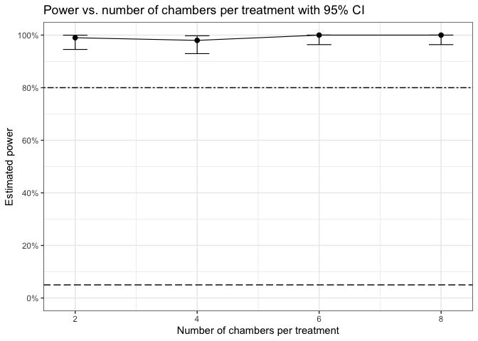

<!-- README.md is generated from README.Rmd. Please edit that file -->

# powergene: A simulation-based power analysis R Package to aid the design of robust semi-field vector control experiments

<!-- badges: start -->

<!-- badges: end -->

This R package simulates mosquito count data under short-term semi-field
experimental designs, incorporating fixed treatment effects and random
chamber variability. It’s built for pragmatic trial planning, MSc-level
teaching, and reproducible research workflows.

This package is an extension of a simulation based power analysis
framework developed by [Kipingu et. al
2025](https://doi.org/10.1186/s12936-025-05454-y). Therefore, all
parameter values for the examples below are taken directily from the
same study. Visit [Kipingu et. al
2025](https://doi.org/10.1186/s12936-025-05454-y) for more information
and description regarding simulation-based power analysis.

## Installation of powergene package

You can install the development version of powergene package directly
from [GitHub](https://github.com/) with:

``` r
# First, install.packages("devtools") if not already installed
install.packages("devtools")
# Then, instal the "powergene" package from github
devtools::install_github("akipingu/powergene")
```

``` r
#load package library
library("powergene")
```

## Example 1: Estimating power of a short-term SFE testing single intervention

This is a basic example which shows you how to apply the powergene
package to estimate power of a short-term SFE

1)  Simulate a table of scenarios based on number of chamber per
    treatment provided, e.g., n.ch.per.trt=4. After specifying number of
    chamber per each treatment (control vs. intervention), the function
    sim.scen.shortsfe.sinint will output three columns including number
    of chambers per each treatment (replicates), treatment status (0 for
    control and 1 for intervention) and id for each individual
    chamber/replicate.

``` r
scen.table <- sim.scen.shortsfe.sinint(n.ch.per.trt = 4)

#print the scenario table
scen.table
#>   replicates treatment chamber
#> 1          1         0     0-1
#> 2          2         0     0-2
#> 3          3         0     0-3
#> 4          4         0     0-4
#> 5          1         1     1-1
#> 6          2         1     1-2
#> 7          3         1     1-3
#> 8          4         1     1-4
```

2)  Simulate mosquitoes counts/abundance by specifying the number of
    chambers per treatment, e.g., n.ch.per.trt = 4, expected mosquitoes
    to be recaptured from a control chamber, e.g., lambda=50,
    intervention effect, e.g., interv.effect = 0.8 for 80% effect, and
    chamber-level variance, e.g., chamber.var = 0.1807. The resultant
    number of mosquitoes will be either with random effect included or
    without including the random effect. Below, columns 4, 5 and 6
    because they are optional but you can print them if you want.
    Remember our main target is the mosquito abundance that account for
    chamber random effect.

``` r
sim.mosquitoes <- sim.mosq.shortsfe.sinint(
  n.ch.per.trt = 4,
  lambda = 50,
  interv.effect = 0.8,
  chamber.var = 0.1807
)

#output mosquito counts per each chamber
sim.mosquitoes <- sim.mosquitoes[, c(-4,-5,-6)]
sim.mosquitoes
#>   replicates treatment chamber mosquito.count.rondom
#> 1          1         0     0-1                    44
#> 2          2         0     0-2                    61
#> 3          3         0     0-3                    32
#> 4          4         0     0-4                    45
#> 5          1         1     1-1                    10
#> 6          2         1     1-2                     3
#> 7          3         1     1-3                     8
#> 8          4         1     1-4                     6
```

3)  Estimate p-value using sim.pval.shortsfe.sinint function by
    specifying the number of chambers per treatment, e.g., n.ch.per.trt
    = 4, expected mosquitoes to be recaptured from a control chamber,
    e.g., lambda=50, intervention effect, e.g., interv.effect = 0.8 for
    80% effect, and chamber-level variance, e.g., chamber.var = 0.1807.
    The p-value estimation is based on mosquito abundance that accounted
    for random chamber effect.

``` r
pvalue <- sim.pval.shortsfe.sinint(
    n.ch.per.trt = 4,
  lambda = 50,
  interv.effect = 0.8,
  chamber.var = 0.1807
)

#output the p-values
pvalue
#>     pvalue 
#> 0.02108097
```

4)  Since power cannot be estimated from a single simulation, there is a
    need to simulate multiple data sets and estimate power. Now you can
    estimate power by specifying the number of chambers per treatment,
    e.g., n.ch.per.trt = 4, expected mosquitoes to be recaptured from a
    control chamber, e.g., lambda=50, intervention effect, e.g.,
    interv.effect = 0.8 for 80% effect, chamber-level variance, e.g.,
    chamber.var = 0.1807, and the total simulations, e.g., nsim=100. A
    100 simulations are just for illustration purpose, but it is
    recommended to run at least 1000 simulations if you are estimating
    power for a real experiment. The power estimation is based on
    mosquito abundance that accounted for random chamber effect.

``` r
power.estimate <- sim.power.shortsfe.sinint(n.ch.per.trt = 4,
  lambda = 50,
  interv.effect = 0.8,
  chamber.var = 0.1807, nsim = 100
  )

#print estimated power
round(power.estimate,2)
#>    power ci.lower ci.upper 
#>     1.00     0.96     1.00
```

22) Now you use the function to estimate power for varied number of
    chambers per treatment, e.g., 2,4,6,8.

``` r
# Define treatment sizes
n.ch.values <- c(2, 4, 6, 8)

# Initialize storage
power.df <- data.frame(
  n.ch.per.trt = n.ch.values,
  power = NA,
  ci.lower = NA,
  ci.upper = NA
)

# Run simulations and extract power + confidence intervals
for (i in seq_along(n.ch.values)) {
  n <- n.ch.values[i]
  
  result <- sim.power.shortsfe.sinint(
    n.ch.per.trt = n,
    lambda = 50,
    interv.effect = 0.8,
    chamber.var = 0.1807,
    nsim = 100
  )
  
  # Store results
  power.df$power[i] <- result["power"]
  power.df$ci.lower[i] <- result["ci.lower"]
  power.df$ci.upper[i] <- result["ci.upper"]
}

#print the power results for each number of chambers per treatment
round(power.df,2)
#>   n.ch.per.trt power ci.lower ci.upper
#> 1            2  0.98     0.93        1
#> 2            4  1.00     0.96        1
#> 3            6  1.00     0.96        1
#> 4            8  1.00     0.96        1
```

6)  Plot the resulting power vs. number of chambers per treatment

``` r
library(ggplot2)

ggplot(power.df, aes(x = n.ch.per.trt, y = power)) +
  geom_point(color = "black", size = 2) +
  geom_line(color = "black", linewidth = 0.4) +
  geom_errorbar(aes(ymin = ci.lower, ymax = ci.upper),
                width = 0.4, color = "black", linewidth = 0.4) +
  labs(
    x = "Number of chambers per treatment",
    y = "Estimated power",
    title = "Power vs. number of chambers per treatment with 95% CI"
  ) +
  scale_y_continuous(labels = scales::percent, limit=c(0,1), breaks=seq(0,1,0.2)) +
  geom_hline(yintercept=0.8, lty="twodash") +
  geom_hline(yintercept=0.05, lty="longdash") +  
  theme_bw()
```



7)  Now you use the function to estimate power for varied number of
    chambers per treatment, e.g., 2,4,6,8 and varied effect size of an
    intervention.

``` r
# Define parameter grids
n.ch.values <- c(2, 4, 6, 8)
effect.sizes <- c(0, 0.4, 0.5, 0.6, 0.8)

# Initialize results storage
results <- expand.grid(
  n.ch.per.trt = n.ch.values,
  interv.effect = effect.sizes
)
results$power <- NA
results$ci.lower <- NA
results$ci.upper <- NA

# Loop over combinations
for (i in seq_len(nrow(results))) {
  row <- results[i, ]
  
  sim <- sim.power.shortsfe.sinint(
    n.ch.per.trt = row$n.ch.per.trt,
    lambda = 50,
    interv.effect = row$interv.effect,
    chamber.var = 0.1807,
    nsim = 100
  )
  
  results$power[i] <- sim["power"]
  results$ci.lower[i] <- sim["ci.lower"]
  results$ci.upper[i] <- sim["ci.upper"]
}
# print power estimates
results
#>    n.ch.per.trt interv.effect power   ci.lower  ci.upper
#> 1             2           0.0  0.25 0.16877974 0.3465525
#> 2             4           0.0  0.10 0.04900469 0.1762226
#> 3             6           0.0  0.11 0.05620702 0.1883011
#> 4             8           0.0  0.08 0.03517156 0.1515576
#> 5             2           0.4  0.43 0.33139102 0.5328663
#> 6             4           0.4  0.54 0.43741158 0.6401566
#> 7             6           0.4  0.50 0.39832113 0.6016789
#> 8             8           0.4  0.68 0.57923314 0.7697801
#> 9             2           0.5  0.50 0.39832113 0.6016789
#> 10            4           0.5  0.71 0.61073404 0.7964258
#> 11            6           0.5  0.78 0.68608035 0.8566964
#> 12            8           0.5  0.86 0.77627202 0.9212946
#> 13            2           0.6  0.79 0.69708462 0.8650563
#> 14            4           0.6  0.83 0.74182459 0.8977351
#> 15            6           0.6  0.96 0.90074284 0.9889955
#> 16            8           0.6  0.97 0.91482395 0.9937700
#> 17            2           0.8  0.96 0.90074284 0.9889955
#> 18            4           0.8  0.98 0.92961607 0.9975687
#> 19            6           0.8  1.00 0.96378331 1.0000000
#> 20            8           0.8  1.00 0.96378331 1.0000000
```

8)  Now plot the resulting power estimates vs. number of chambers per
    treatment or effect sizes.

``` r
library(ggplot2)

ggplot(results, aes(x = n.ch.per.trt, y = power, color = factor(interv.effect), group = interv.effect)) +
  geom_point(size = 2) +
  geom_line(linewidth = 0.8) +
  geom_errorbar(aes(ymin = ci.lower, ymax = ci.upper),
                width = 0.3, linewidth = 0.6) +
  geom_hline(yintercept = 0.8, linetype = "twodash", color = "gray50") +
  geom_hline(yintercept = 0.05, linetype = "longdash", color = "gray50") +
  scale_y_continuous(labels = scales::percent, limits = c(0, 1), breaks = seq(0, 1, 0.2)) +
  scale_color_brewer(palette = "Dark2", name = "Effect Size \n(% reduction)") +
  labs(
    x = "Number of chambers per treatment",
    y = "Estimated power",
    title = "Power vs. number of chamber per treatment by intervention effect Size"
  ) +
  theme_bw()
```


