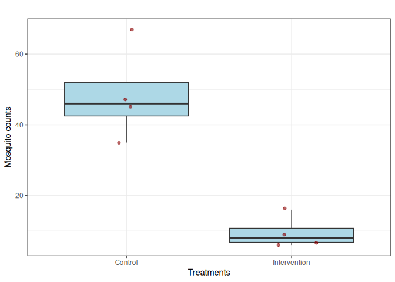
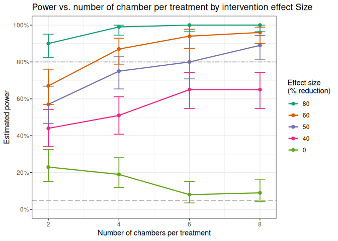

<!-- README.md is generated from README.Rmd. Please edit that file -->

# powergene: A simulation-based power analysis R Package to aid the design of robust semi-field vector control experiments

<!-- badges: start -->
<!-- badges: end -->

The powergene R package simulates mosquito count data under short- and
long-term semi-field experimental design scenarios, evaluating single or
combined interventions. It incorporates fixed treatment effects, random
chamber-level or sampling time-level variability to support robust power
analysis for short- or long-term semi-field experimental planning.

This package is an extension of a simulation based power analysis
framework developed by [Kipingu et. al
2025](https://doi.org/10.1186/s12936-025-05454-y). Therefore, all
parameter values for the examples below are taken directily from the
same study. Visit [Kipingu et. al
2025](https://doi.org/10.1186/s12936-025-05454-y) for more information
and description regarding simulation-based power analysis.

## Installation of powergene package

You can install the development version of powergene package directly
from [GitHub](https://github.com/) with:

    # First, install.packages("devtools") if not already installed in your RStudio
    install.packages("devtools")
    # Then, instal the "powergene" package from github
    devtools::install_github("akipingu/powergene")

    #load package library
    library("powergene")

## Example 1: Estimating power of a short-term SFE testing single intervention

This is a basic example which shows you how to apply the powergene
package to estimate power of a short-term SFE

1.  Simulate a table of scenarios based on number of chamber per
    treatment provided, e.g., n.ch.per.trt=4. After specifying number of
    chamber per each treatment (control vs. intervention), the function
    sim.scen.shortsfe.sinint will output three columns including number
    of chambers per each treatment (replicates), treatment status as
    intvn (0 for control and 1 for intervention) and id for each
    individual chamber/replicate.

<!-- -->

    scen.table <- sim.scen.shortsfe.sinint(n.ch.per.trt = 4)

    #print a scenario table
    scen.table
    #>   replicates intvn chamber
    #> 1          1     0     0-1
    #> 2          2     0     0-2
    #> 3          3     0     0-3
    #> 4          4     0     0-4
    #> 5          1     1     1-1
    #> 6          2     1     1-2
    #> 7          3     1     1-3
    #> 8          4     1     1-4

1.  Simulate mosquitoes counts/abundance by specifying the number of
    chambers per treatment, e.g., n.ch.per.trt = 4, expected mosquitoes
    to be recaptured from a control chamber, e.g., lambda=50,
    intervention effect, e.g., interv.effect = 0.8 for 80% effect, and
    chamber-level variance, e.g., chamber.var = 0.1807. The resultant
    number of mosquitoes will be either with random effect included or
    without including the random effect. Below, columns 4, 5 and 6
    because they are optional but you can print them if you want.
    Remember our main target is the mosquito abundance that account for
    chamber random effect. The use.random has four options to output
    mosquito count column either with the use of random effect (TRUE),
    fixed effect only (FALSE), only fixed effect from exponential
    function rather than from a known statistical distribution (NULL) or
    all mosquito count columns (“ALL”). Below I set use.random = “ALL”
    as an example.

<!-- -->

    sim.mosquitoes <- sim.mosq.shortsfe.sinint(
      n.ch.per.trt = 4,
      lambda = 50,
      interv.effect = 0.8,
      chamber.var = 0.1807,
      use.random = "ALL"
    )

    #output mosquito counts per each chamber
    sim.mosquitoes <- sim.mosquitoes[, c(-4,-5,-6)]
    sim.mosquitoes
    #>   replicates intvn chamber mosquito.count.fixed mosquito.count.random
    #> 1          1     0     0-1                   42                   130
    #> 2          2     0     0-2                   54                    69
    #> 3          3     0     0-3                   50                    66
    #> 4          4     0     0-4                   61                    49
    #> 5          1     1     1-1                   13                     7
    #> 6          2     1     1-2                    9                     5
    #> 7          3     1     1-3                    5                    13
    #> 8          4     1     1-4                   12                     9

1.  Plot the simulated mosquitoes. This function plots a box plot with
    an option to jitter points if jitter=TURE and without jittering if
    jitter=FALSE. The use.random option is also used in this function
    with only TRUE, FALSE or NULL as explained in (ii) above

<!-- -->

    sim.plot.shortsfe.sinint(
      n.ch.per.trt = 4,
      lambda = 50,
      interv.effect = 0.8,
      chamber.var = 0.1807,
      use.random = TRUE,
      jitter = TRUE
    )

1.  Estimate p-value using sim.pval.shortsfe.sinint function by
    specifying the number of chambers per treatment, e.g., n.ch.per.trt
    = 4, expected mosquitoes to be recaptured from a control chamber,
    e.g., lambda=50, intervention effect, e.g., interv.effect = 0.8 for
    80% effect, and chamber-level variance, e.g., chamber.var = 0.1807.
    The p-value estimation is based on mosquito abundance that accounted
    for random chamber effect. The use.random option is also used in
    this function with only TRUE or FALSE as explained in (ii) above

<!-- -->

    pvalue <- sim.pval.shortsfe.sinint(
        n.ch.per.trt = 4,
      lambda = 50,
      interv.effect = 0.8,
      chamber.var = 0.1807,
      use.random = TRUE
    )

    #output the p-values
    pvalue
    #>       pvalue 
    #> 0.0006791409

1.  Since power cannot be estimated from a single simulation, there is a
    need to simulate multiple data sets and estimate power. Now you can
    estimate power by specifying the number of chambers per treatment,
    e.g., n.ch.per.trt = 4, expected mosquitoes to be recaptured from a
    control chamber, e.g., lambda=50, intervention effect, e.g.,
    interv.effect = 0.8 for 80% effect, chamber-level variance, e.g.,
    chamber.var = 0.1807, and the total simulations, e.g., nsim=100. A
    100 simulations are just for illustration purpose, but it is
    recommended to run at least 1000 simulations if you are estimating
    power for a real experiment. The power estimation is based on
    mosquito abundance that accounted for random chamber effect. The
    use.random option is also used in this function with only TRUE or
    FALSE as explained in (ii) above.

<!-- -->

    power.estimate <- sim.power.shortsfe.sinint(n.ch.per.trt = 4,
      lambda = 50,
      interv.effect = 0.8,
      chamber.var = 0.1807, 
      nsim = 100,
      use.random = TRUE
      )
    #>   |                                                                                                                   |                                                                                                           |   0%  |                                                                                                                   |=                                                                                                          |   1%  |                                                                                                                   |==                                                                                                         |   2%  |                                                                                                                   |===                                                                                                        |   3%  |                                                                                                                   |====                                                                                                       |   4%  |                                                                                                                   |=====                                                                                                      |   5%  |                                                                                                                   |======                                                                                                     |   6%  |                                                                                                                   |=======                                                                                                    |   7%  |                                                                                                                   |=========                                                                                                  |   8%  |                                                                                                                   |==========                                                                                                 |   9%  |                                                                                                                   |===========                                                                                                |  10%  |                                                                                                                   |============                                                                                               |  11%  |                                                                                                                   |=============                                                                                              |  12%  |                                                                                                                   |==============                                                                                             |  13%  |                                                                                                                   |===============                                                                                            |  14%  |                                                                                                                   |================                                                                                           |  15%  |                                                                                                                   |=================                                                                                          |  16%  |                                                                                                                   |==================                                                                                         |  17%  |                                                                                                                   |===================                                                                                        |  18%  |                                                                                                                   |====================                                                                                       |  19%  |                                                                                                                   |=====================                                                                                      |  20%  |                                                                                                                   |======================                                                                                     |  21%  |                                                                                                                   |========================                                                                                   |  22%  |                                                                                                                   |=========================                                                                                  |  23%  |                                                                                                                   |==========================                                                                                 |  24%  |                                                                                                                   |===========================                                                                                |  25%  |                                                                                                                   |============================                                                                               |  26%  |                                                                                                                   |=============================                                                                              |  27%  |                                                                                                                   |==============================                                                                             |  28%  |                                                                                                                   |===============================                                                                            |  29%  |                                                                                                                   |================================                                                                           |  30%  |                                                                                                                   |=================================                                                                          |  31%  |                                                                                                                   |==================================                                                                         |  32%  |                                                                                                                   |===================================                                                                        |  33%  |                                                                                                                   |====================================                                                                       |  34%  |                                                                                                                   |=====================================                                                                      |  35%  |                                                                                                                   |=======================================                                                                    |  36%  |                                                                                                                   |========================================                                                                   |  37%  |                                                                                                                   |=========================================                                                                  |  38%  |                                                                                                                   |==========================================                                                                 |  39%  |                                                                                                                   |===========================================                                                                |  40%  |                                                                                                                   |============================================                                                               |  41%  |                                                                                                                   |=============================================                                                              |  42%  |                                                                                                                   |==============================================                                                             |  43%  |                                                                                                                   |===============================================                                                            |  44%  |                                                                                                                   |================================================                                                           |  45%  |                                                                                                                   |=================================================                                                          |  46%  |                                                                                                                   |==================================================                                                         |  47%  |                                                                                                                   |===================================================                                                        |  48%  |                                                                                                                   |====================================================                                                       |  49%  |                                                                                                                   |======================================================                                                     |  50%  |                                                                                                                   |=======================================================                                                    |  51%  |                                                                                                                   |========================================================                                                   |  52%  |                                                                                                                   |=========================================================                                                  |  53%  |                                                                                                                   |==========================================================                                                 |  54%  |                                                                                                                   |===========================================================                                                |  55%  |                                                                                                                   |============================================================                                               |  56%  |                                                                                                                   |=============================================================                                              |  57%  |                                                                                                                   |==============================================================                                             |  58%  |                                                                                                                   |===============================================================                                            |  59%  |                                                                                                                   |================================================================                                           |  60%  |                                                                                                                   |=================================================================                                          |  61%  |                                                                                                                   |==================================================================                                         |  62%  |                                                                                                                   |===================================================================                                        |  63%  |                                                                                                                   |====================================================================                                       |  64%  |                                                                                                                   |======================================================================                                     |  65%  |                                                                                                                   |=======================================================================                                    |  66%  |                                                                                                                   |========================================================================                                   |  67%  |                                                                                                                   |=========================================================================                                  |  68%  |                                                                                                                   |==========================================================================                                 |  69%  |                                                                                                                   |===========================================================================                                |  70%  |                                                                                                                   |============================================================================                               |  71%  |                                                                                                                   |=============================================================================                              |  72%  |                                                                                                                   |==============================================================================                             |  73%  |                                                                                                                   |===============================================================================                            |  74%  |                                                                                                                   |================================================================================                           |  75%  |                                                                                                                   |=================================================================================                          |  76%  |                                                                                                                   |==================================================================================                         |  77%  |                                                                                                                   |===================================================================================                        |  78%  |                                                                                                                   |=====================================================================================                      |  79%  |                                                                                                                   |======================================================================================                     |  80%  |                                                                                                                   |=======================================================================================                    |  81%  |                                                                                                                   |========================================================================================                   |  82%  |                                                                                                                   |=========================================================================================                  |  83%  |                                                                                                                   |==========================================================================================                 |  84%  |                                                                                                                   |===========================================================================================                |  85%  |                                                                                                                   |============================================================================================               |  86%  |                                                                                                                   |=============================================================================================              |  87%  |                                                                                                                   |==============================================================================================             |  88%  |                                                                                                                   |===============================================================================================            |  89%  |                                                                                                                   |================================================================================================           |  90%  |                                                                                                                   |=================================================================================================          |  91%  |                                                                                                                   |==================================================================================================         |  92%  |                                                                                                                   |====================================================================================================       |  93%  |                                                                                                                   |=====================================================================================================      |  94%  |                                                                                                                   |======================================================================================================     |  95%  |                                                                                                                   |=======================================================================================================    |  96%  |                                                                                                                   |========================================================================================================   |  97%  |                                                                                                                   |=========================================================================================================  |  98%  |                                                                                                                   |========================================================================================================== |  99%  |                                                                                                                   |===========================================================================================================| 100%

    #print estimated power
    round(power.estimate,2)
    #>    power ci.lower ci.upper 
    #>     1.00     0.96     1.00

1.  Now you use the function to estimate power for varied number of
    chambers per treatment, e.g., 2,4,6,8.

<!-- -->

    # Define treatment sizes
    n.ch.values <- c(2, 4, 6, 8)

    # Initialize storage
    power.df <- data.frame(
      n.ch.per.trt = n.ch.values,
      power = NA,
      ci.lower = NA,
      ci.upper = NA
    )

    # Run simulations and extract power + confidence intervals
    for (i in seq_along(n.ch.values)) {
      n <- n.ch.values[i]
      
      result <- sim.power.shortsfe.sinint(
        n.ch.per.trt = n,
        lambda = 50,
        interv.effect = 0.8,
        chamber.var = 0.1807,
        nsim = 100,
        use.random = TRUE
      )
      
      # Store results
      power.df$power[i] <- result["power"]
      power.df$ci.lower[i] <- result["ci.lower"]
      power.df$ci.upper[i] <- result["ci.upper"]
    }
    #>   |                                                                                                                   |                                                                                                           |   0%  |                                                                                                                   |=                                                                                                          |   1%  |                                                                                                                   |==                                                                                                         |   2%  |                                                                                                                   |===                                                                                                        |   3%  |                                                                                                                   |====                                                                                                       |   4%  |                                                                                                                   |=====                                                                                                      |   5%  |                                                                                                                   |======                                                                                                     |   6%  |                                                                                                                   |=======                                                                                                    |   7%  |                                                                                                                   |=========                                                                                                  |   8%  |                                                                                                                   |==========                                                                                                 |   9%  |                                                                                                                   |===========                                                                                                |  10%  |                                                                                                                   |============                                                                                               |  11%  |                                                                                                                   |=============                                                                                              |  12%  |                                                                                                                   |==============                                                                                             |  13%  |                                                                                                                   |===============                                                                                            |  14%  |                                                                                                                   |================                                                                                           |  15%  |                                                                                                                   |=================                                                                                          |  16%  |                                                                                                                   |==================                                                                                         |  17%  |                                                                                                                   |===================                                                                                        |  18%  |                                                                                                                   |====================                                                                                       |  19%  |                                                                                                                   |=====================                                                                                      |  20%  |                                                                                                                   |======================                                                                                     |  21%  |                                                                                                                   |========================                                                                                   |  22%  |                                                                                                                   |=========================                                                                                  |  23%  |                                                                                                                   |==========================                                                                                 |  24%  |                                                                                                                   |===========================                                                                                |  25%  |                                                                                                                   |============================                                                                               |  26%  |                                                                                                                   |=============================                                                                              |  27%  |                                                                                                                   |==============================                                                                             |  28%  |                                                                                                                   |===============================                                                                            |  29%  |                                                                                                                   |================================                                                                           |  30%  |                                                                                                                   |=================================                                                                          |  31%  |                                                                                                                   |==================================                                                                         |  32%  |                                                                                                                   |===================================                                                                        |  33%  |                                                                                                                   |====================================                                                                       |  34%  |                                                                                                                   |=====================================                                                                      |  35%  |                                                                                                                   |=======================================                                                                    |  36%  |                                                                                                                   |========================================                                                                   |  37%  |                                                                                                                   |=========================================                                                                  |  38%  |                                                                                                                   |==========================================                                                                 |  39%  |                                                                                                                   |===========================================                                                                |  40%  |                                                                                                                   |============================================                                                               |  41%  |                                                                                                                   |=============================================                                                              |  42%  |                                                                                                                   |==============================================                                                             |  43%  |                                                                                                                   |===============================================                                                            |  44%  |                                                                                                                   |================================================                                                           |  45%  |                                                                                                                   |=================================================                                                          |  46%  |                                                                                                                   |==================================================                                                         |  47%  |                                                                                                                   |===================================================                                                        |  48%  |                                                                                                                   |====================================================                                                       |  49%  |                                                                                                                   |======================================================                                                     |  50%  |                                                                                                                   |=======================================================                                                    |  51%  |                                                                                                                   |========================================================                                                   |  52%  |                                                                                                                   |=========================================================                                                  |  53%  |                                                                                                                   |==========================================================                                                 |  54%  |                                                                                                                   |===========================================================                                                |  55%  |                                                                                                                   |============================================================                                               |  56%  |                                                                                                                   |=============================================================                                              |  57%  |                                                                                                                   |==============================================================                                             |  58%  |                                                                                                                   |===============================================================                                            |  59%  |                                                                                                                   |================================================================                                           |  60%  |                                                                                                                   |=================================================================                                          |  61%  |                                                                                                                   |==================================================================                                         |  62%  |                                                                                                                   |===================================================================                                        |  63%  |                                                                                                                   |====================================================================                                       |  64%  |                                                                                                                   |======================================================================                                     |  65%  |                                                                                                                   |=======================================================================                                    |  66%  |                                                                                                                   |========================================================================                                   |  67%  |                                                                                                                   |=========================================================================                                  |  68%  |                                                                                                                   |==========================================================================                                 |  69%  |                                                                                                                   |===========================================================================                                |  70%  |                                                                                                                   |============================================================================                               |  71%  |                                                                                                                   |=============================================================================                              |  72%  |                                                                                                                   |==============================================================================                             |  73%  |                                                                                                                   |===============================================================================                            |  74%  |                                                                                                                   |================================================================================                           |  75%  |                                                                                                                   |=================================================================================                          |  76%  |                                                                                                                   |==================================================================================                         |  77%  |                                                                                                                   |===================================================================================                        |  78%  |                                                                                                                   |=====================================================================================                      |  79%  |                                                                                                                   |======================================================================================                     |  80%  |                                                                                                                   |=======================================================================================                    |  81%  |                                                                                                                   |========================================================================================                   |  82%  |                                                                                                                   |=========================================================================================                  |  83%  |                                                                                                                   |==========================================================================================                 |  84%  |                                                                                                                   |===========================================================================================                |  85%  |                                                                                                                   |============================================================================================               |  86%  |                                                                                                                   |=============================================================================================              |  87%  |                                                                                                                   |==============================================================================================             |  88%  |                                                                                                                   |===============================================================================================            |  89%  |                                                                                                                   |================================================================================================           |  90%  |                                                                                                                   |=================================================================================================          |  91%  |                                                                                                                   |==================================================================================================         |  92%  |                                                                                                                   |====================================================================================================       |  93%
    #> Warning in vcov.merMod(object, use.hessian = use.hessian): variance-covariance matrix computed from finite-difference Hessian is
    #> not positive definite or contains NA values: falling back to var-cov estimated from RX
    #> Warning in vcov.merMod(object, correlation = correlation, sigm = sig): variance-covariance matrix computed from finite-difference Hessian is
    #> not positive definite or contains NA values: falling back to var-cov estimated from RX
    #>   |                                                                                                                   |=====================================================================================================      |  94%  |                                                                                                                   |======================================================================================================     |  95%  |                                                                                                                   |=======================================================================================================    |  96%  |                                                                                                                   |========================================================================================================   |  97%  |                                                                                                                   |=========================================================================================================  |  98%  |                                                                                                                   |========================================================================================================== |  99%  |                                                                                                                   |===========================================================================================================| 100%
    #>   |                                                                                                                   |                                                                                                           |   0%  |                                                                                                                   |=                                                                                                          |   1%  |                                                                                                                   |==                                                                                                         |   2%  |                                                                                                                   |===                                                                                                        |   3%  |                                                                                                                   |====                                                                                                       |   4%  |                                                                                                                   |=====                                                                                                      |   5%  |                                                                                                                   |======                                                                                                     |   6%  |                                                                                                                   |=======                                                                                                    |   7%  |                                                                                                                   |=========                                                                                                  |   8%  |                                                                                                                   |==========                                                                                                 |   9%  |                                                                                                                   |===========                                                                                                |  10%  |                                                                                                                   |============                                                                                               |  11%  |                                                                                                                   |=============                                                                                              |  12%  |                                                                                                                   |==============                                                                                             |  13%  |                                                                                                                   |===============                                                                                            |  14%  |                                                                                                                   |================                                                                                           |  15%  |                                                                                                                   |=================                                                                                          |  16%  |                                                                                                                   |==================                                                                                         |  17%  |                                                                                                                   |===================                                                                                        |  18%  |                                                                                                                   |====================                                                                                       |  19%  |                                                                                                                   |=====================                                                                                      |  20%  |                                                                                                                   |======================                                                                                     |  21%  |                                                                                                                   |========================                                                                                   |  22%  |                                                                                                                   |=========================                                                                                  |  23%  |                                                                                                                   |==========================                                                                                 |  24%  |                                                                                                                   |===========================                                                                                |  25%  |                                                                                                                   |============================                                                                               |  26%  |                                                                                                                   |=============================                                                                              |  27%  |                                                                                                                   |==============================                                                                             |  28%  |                                                                                                                   |===============================                                                                            |  29%  |                                                                                                                   |================================                                                                           |  30%  |                                                                                                                   |=================================                                                                          |  31%  |                                                                                                                   |==================================                                                                         |  32%  |                                                                                                                   |===================================                                                                        |  33%  |                                                                                                                   |====================================                                                                       |  34%  |                                                                                                                   |=====================================                                                                      |  35%  |                                                                                                                   |=======================================                                                                    |  36%  |                                                                                                                   |========================================                                                                   |  37%  |                                                                                                                   |=========================================                                                                  |  38%  |                                                                                                                   |==========================================                                                                 |  39%  |                                                                                                                   |===========================================                                                                |  40%  |                                                                                                                   |============================================                                                               |  41%  |                                                                                                                   |=============================================                                                              |  42%  |                                                                                                                   |==============================================                                                             |  43%  |                                                                                                                   |===============================================                                                            |  44%  |                                                                                                                   |================================================                                                           |  45%  |                                                                                                                   |=================================================                                                          |  46%  |                                                                                                                   |==================================================                                                         |  47%  |                                                                                                                   |===================================================                                                        |  48%  |                                                                                                                   |====================================================                                                       |  49%  |                                                                                                                   |======================================================                                                     |  50%  |                                                                                                                   |=======================================================                                                    |  51%  |                                                                                                                   |========================================================                                                   |  52%  |                                                                                                                   |=========================================================                                                  |  53%  |                                                                                                                   |==========================================================                                                 |  54%  |                                                                                                                   |===========================================================                                                |  55%  |                                                                                                                   |============================================================                                               |  56%  |                                                                                                                   |=============================================================                                              |  57%  |                                                                                                                   |==============================================================                                             |  58%  |                                                                                                                   |===============================================================                                            |  59%  |                                                                                                                   |================================================================                                           |  60%  |                                                                                                                   |=================================================================                                          |  61%  |                                                                                                                   |==================================================================                                         |  62%  |                                                                                                                   |===================================================================                                        |  63%  |                                                                                                                   |====================================================================                                       |  64%  |                                                                                                                   |======================================================================                                     |  65%  |                                                                                                                   |=======================================================================                                    |  66%  |                                                                                                                   |========================================================================                                   |  67%  |                                                                                                                   |=========================================================================                                  |  68%  |                                                                                                                   |==========================================================================                                 |  69%  |                                                                                                                   |===========================================================================                                |  70%  |                                                                                                                   |============================================================================                               |  71%  |                                                                                                                   |=============================================================================                              |  72%  |                                                                                                                   |==============================================================================                             |  73%  |                                                                                                                   |===============================================================================                            |  74%  |                                                                                                                   |================================================================================                           |  75%  |                                                                                                                   |=================================================================================                          |  76%  |                                                                                                                   |==================================================================================                         |  77%  |                                                                                                                   |===================================================================================                        |  78%  |                                                                                                                   |=====================================================================================                      |  79%  |                                                                                                                   |======================================================================================                     |  80%  |                                                                                                                   |=======================================================================================                    |  81%  |                                                                                                                   |========================================================================================                   |  82%  |                                                                                                                   |=========================================================================================                  |  83%  |                                                                                                                   |==========================================================================================                 |  84%  |                                                                                                                   |===========================================================================================                |  85%  |                                                                                                                   |============================================================================================               |  86%  |                                                                                                                   |=============================================================================================              |  87%  |                                                                                                                   |==============================================================================================             |  88%  |                                                                                                                   |===============================================================================================            |  89%  |                                                                                                                   |================================================================================================           |  90%  |                                                                                                                   |=================================================================================================          |  91%  |                                                                                                                   |==================================================================================================         |  92%  |                                                                                                                   |====================================================================================================       |  93%  |                                                                                                                   |=====================================================================================================      |  94%  |                                                                                                                   |======================================================================================================     |  95%  |                                                                                                                   |=======================================================================================================    |  96%  |                                                                                                                   |========================================================================================================   |  97%  |                                                                                                                   |=========================================================================================================  |  98%  |                                                                                                                   |========================================================================================================== |  99%  |                                                                                                                   |===========================================================================================================| 100%
    #>   |                                                                                                                   |                                                                                                           |   0%  |                                                                                                                   |=                                                                                                          |   1%  |                                                                                                                   |==                                                                                                         |   2%  |                                                                                                                   |===                                                                                                        |   3%  |                                                                                                                   |====                                                                                                       |   4%  |                                                                                                                   |=====                                                                                                      |   5%  |                                                                                                                   |======                                                                                                     |   6%  |                                                                                                                   |=======                                                                                                    |   7%  |                                                                                                                   |=========                                                                                                  |   8%  |                                                                                                                   |==========                                                                                                 |   9%  |                                                                                                                   |===========                                                                                                |  10%  |                                                                                                                   |============                                                                                               |  11%  |                                                                                                                   |=============                                                                                              |  12%  |                                                                                                                   |==============                                                                                             |  13%  |                                                                                                                   |===============                                                                                            |  14%  |                                                                                                                   |================                                                                                           |  15%  |                                                                                                                   |=================                                                                                          |  16%  |                                                                                                                   |==================                                                                                         |  17%  |                                                                                                                   |===================                                                                                        |  18%  |                                                                                                                   |====================                                                                                       |  19%  |                                                                                                                   |=====================                                                                                      |  20%  |                                                                                                                   |======================                                                                                     |  21%  |                                                                                                                   |========================                                                                                   |  22%  |                                                                                                                   |=========================                                                                                  |  23%  |                                                                                                                   |==========================                                                                                 |  24%  |                                                                                                                   |===========================                                                                                |  25%  |                                                                                                                   |============================                                                                               |  26%  |                                                                                                                   |=============================                                                                              |  27%  |                                                                                                                   |==============================                                                                             |  28%  |                                                                                                                   |===============================                                                                            |  29%  |                                                                                                                   |================================                                                                           |  30%  |                                                                                                                   |=================================                                                                          |  31%  |                                                                                                                   |==================================                                                                         |  32%  |                                                                                                                   |===================================                                                                        |  33%  |                                                                                                                   |====================================                                                                       |  34%  |                                                                                                                   |=====================================                                                                      |  35%  |                                                                                                                   |=======================================                                                                    |  36%  |                                                                                                                   |========================================                                                                   |  37%  |                                                                                                                   |=========================================                                                                  |  38%  |                                                                                                                   |==========================================                                                                 |  39%  |                                                                                                                   |===========================================                                                                |  40%  |                                                                                                                   |============================================                                                               |  41%  |                                                                                                                   |=============================================                                                              |  42%  |                                                                                                                   |==============================================                                                             |  43%  |                                                                                                                   |===============================================                                                            |  44%  |                                                                                                                   |================================================                                                           |  45%  |                                                                                                                   |=================================================                                                          |  46%  |                                                                                                                   |==================================================                                                         |  47%  |                                                                                                                   |===================================================                                                        |  48%  |                                                                                                                   |====================================================                                                       |  49%  |                                                                                                                   |======================================================                                                     |  50%  |                                                                                                                   |=======================================================                                                    |  51%  |                                                                                                                   |========================================================                                                   |  52%  |                                                                                                                   |=========================================================                                                  |  53%  |                                                                                                                   |==========================================================                                                 |  54%  |                                                                                                                   |===========================================================                                                |  55%  |                                                                                                                   |============================================================                                               |  56%  |                                                                                                                   |=============================================================                                              |  57%  |                                                                                                                   |==============================================================                                             |  58%  |                                                                                                                   |===============================================================                                            |  59%  |                                                                                                                   |================================================================                                           |  60%  |                                                                                                                   |=================================================================                                          |  61%  |                                                                                                                   |==================================================================                                         |  62%  |                                                                                                                   |===================================================================                                        |  63%  |                                                                                                                   |====================================================================                                       |  64%  |                                                                                                                   |======================================================================                                     |  65%  |                                                                                                                   |=======================================================================                                    |  66%  |                                                                                                                   |========================================================================                                   |  67%  |                                                                                                                   |=========================================================================                                  |  68%  |                                                                                                                   |==========================================================================                                 |  69%  |                                                                                                                   |===========================================================================                                |  70%  |                                                                                                                   |============================================================================                               |  71%  |                                                                                                                   |=============================================================================                              |  72%  |                                                                                                                   |==============================================================================                             |  73%  |                                                                                                                   |===============================================================================                            |  74%  |                                                                                                                   |================================================================================                           |  75%  |                                                                                                                   |=================================================================================                          |  76%  |                                                                                                                   |==================================================================================                         |  77%  |                                                                                                                   |===================================================================================                        |  78%  |                                                                                                                   |=====================================================================================                      |  79%  |                                                                                                                   |======================================================================================                     |  80%  |                                                                                                                   |=======================================================================================                    |  81%  |                                                                                                                   |========================================================================================                   |  82%  |                                                                                                                   |=========================================================================================                  |  83%  |                                                                                                                   |==========================================================================================                 |  84%  |                                                                                                                   |===========================================================================================                |  85%  |                                                                                                                   |============================================================================================               |  86%  |                                                                                                                   |=============================================================================================              |  87%  |                                                                                                                   |==============================================================================================             |  88%  |                                                                                                                   |===============================================================================================            |  89%  |                                                                                                                   |================================================================================================           |  90%  |                                                                                                                   |=================================================================================================          |  91%  |                                                                                                                   |==================================================================================================         |  92%  |                                                                                                                   |====================================================================================================       |  93%  |                                                                                                                   |=====================================================================================================      |  94%  |                                                                                                                   |======================================================================================================     |  95%  |                                                                                                                   |=======================================================================================================    |  96%  |                                                                                                                   |========================================================================================================   |  97%  |                                                                                                                   |=========================================================================================================  |  98%  |                                                                                                                   |========================================================================================================== |  99%  |                                                                                                                   |===========================================================================================================| 100%
    #>   |                                                                                                                   |                                                                                                           |   0%  |                                                                                                                   |=                                                                                                          |   1%  |                                                                                                                   |==                                                                                                         |   2%  |                                                                                                                   |===                                                                                                        |   3%  |                                                                                                                   |====                                                                                                       |   4%  |                                                                                                                   |=====                                                                                                      |   5%  |                                                                                                                   |======                                                                                                     |   6%  |                                                                                                                   |=======                                                                                                    |   7%  |                                                                                                                   |=========                                                                                                  |   8%  |                                                                                                                   |==========                                                                                                 |   9%  |                                                                                                                   |===========                                                                                                |  10%  |                                                                                                                   |============                                                                                               |  11%  |                                                                                                                   |=============                                                                                              |  12%  |                                                                                                                   |==============                                                                                             |  13%  |                                                                                                                   |===============                                                                                            |  14%  |                                                                                                                   |================                                                                                           |  15%  |                                                                                                                   |=================                                                                                          |  16%  |                                                                                                                   |==================                                                                                         |  17%  |                                                                                                                   |===================                                                                                        |  18%  |                                                                                                                   |====================                                                                                       |  19%  |                                                                                                                   |=====================                                                                                      |  20%  |                                                                                                                   |======================                                                                                     |  21%  |                                                                                                                   |========================                                                                                   |  22%  |                                                                                                                   |=========================                                                                                  |  23%  |                                                                                                                   |==========================                                                                                 |  24%  |                                                                                                                   |===========================                                                                                |  25%  |                                                                                                                   |============================                                                                               |  26%  |                                                                                                                   |=============================                                                                              |  27%  |                                                                                                                   |==============================                                                                             |  28%  |                                                                                                                   |===============================                                                                            |  29%  |                                                                                                                   |================================                                                                           |  30%  |                                                                                                                   |=================================                                                                          |  31%  |                                                                                                                   |==================================                                                                         |  32%  |                                                                                                                   |===================================                                                                        |  33%  |                                                                                                                   |====================================                                                                       |  34%  |                                                                                                                   |=====================================                                                                      |  35%  |                                                                                                                   |=======================================                                                                    |  36%  |                                                                                                                   |========================================                                                                   |  37%  |                                                                                                                   |=========================================                                                                  |  38%  |                                                                                                                   |==========================================                                                                 |  39%  |                                                                                                                   |===========================================                                                                |  40%  |                                                                                                                   |============================================                                                               |  41%  |                                                                                                                   |=============================================                                                              |  42%  |                                                                                                                   |==============================================                                                             |  43%  |                                                                                                                   |===============================================                                                            |  44%  |                                                                                                                   |================================================                                                           |  45%  |                                                                                                                   |=================================================                                                          |  46%  |                                                                                                                   |==================================================                                                         |  47%  |                                                                                                                   |===================================================                                                        |  48%  |                                                                                                                   |====================================================                                                       |  49%  |                                                                                                                   |======================================================                                                     |  50%  |                                                                                                                   |=======================================================                                                    |  51%  |                                                                                                                   |========================================================                                                   |  52%  |                                                                                                                   |=========================================================                                                  |  53%  |                                                                                                                   |==========================================================                                                 |  54%  |                                                                                                                   |===========================================================                                                |  55%  |                                                                                                                   |============================================================                                               |  56%  |                                                                                                                   |=============================================================                                              |  57%  |                                                                                                                   |==============================================================                                             |  58%  |                                                                                                                   |===============================================================                                            |  59%  |                                                                                                                   |================================================================                                           |  60%  |                                                                                                                   |=================================================================                                          |  61%  |                                                                                                                   |==================================================================                                         |  62%  |                                                                                                                   |===================================================================                                        |  63%  |                                                                                                                   |====================================================================                                       |  64%  |                                                                                                                   |======================================================================                                     |  65%  |                                                                                                                   |=======================================================================                                    |  66%  |                                                                                                                   |========================================================================                                   |  67%  |                                                                                                                   |=========================================================================                                  |  68%  |                                                                                                                   |==========================================================================                                 |  69%  |                                                                                                                   |===========================================================================                                |  70%  |                                                                                                                   |============================================================================                               |  71%  |                                                                                                                   |=============================================================================                              |  72%  |                                                                                                                   |==============================================================================                             |  73%  |                                                                                                                   |===============================================================================                            |  74%  |                                                                                                                   |================================================================================                           |  75%  |                                                                                                                   |=================================================================================                          |  76%  |                                                                                                                   |==================================================================================                         |  77%  |                                                                                                                   |===================================================================================                        |  78%  |                                                                                                                   |=====================================================================================                      |  79%  |                                                                                                                   |======================================================================================                     |  80%  |                                                                                                                   |=======================================================================================                    |  81%  |                                                                                                                   |========================================================================================                   |  82%  |                                                                                                                   |=========================================================================================                  |  83%  |                                                                                                                   |==========================================================================================                 |  84%  |                                                                                                                   |===========================================================================================                |  85%  |                                                                                                                   |============================================================================================               |  86%  |                                                                                                                   |=============================================================================================              |  87%  |                                                                                                                   |==============================================================================================             |  88%  |                                                                                                                   |===============================================================================================            |  89%  |                                                                                                                   |================================================================================================           |  90%  |                                                                                                                   |=================================================================================================          |  91%  |                                                                                                                   |==================================================================================================         |  92%  |                                                                                                                   |====================================================================================================       |  93%  |                                                                                                                   |=====================================================================================================      |  94%  |                                                                                                                   |======================================================================================================     |  95%  |                                                                                                                   |=======================================================================================================    |  96%  |                                                                                                                   |========================================================================================================   |  97%  |                                                                                                                   |=========================================================================================================  |  98%  |                                                                                                                   |========================================================================================================== |  99%  |                                                                                                                   |===========================================================================================================| 100%

    #print the power results for each number of chambers per treatment
    round(power.df,2)
    #>   n.ch.per.trt power ci.lower ci.upper
    #> 1            2  0.93     0.86     0.97
    #> 2            4  0.99     0.95     1.00
    #> 3            6  1.00     0.96     1.00
    #> 4            8  1.00     0.96     1.00

1.  Plot the resulting power vs. number of chambers per treatment

<!-- -->

    library(ggplot2)

    ggplot(power.df, aes(x = n.ch.per.trt, y = power)) +
      geom_point(color = "black", size = 2) +
      geom_line(color = "black", linewidth = 0.4) +
      geom_errorbar(aes(ymin = ci.lower, ymax = ci.upper),
                    width = 0.4, color = "black", linewidth = 0.4) +
      labs(
        x = "Number of chambers per treatment",
        y = "Estimated power",
        title = "Power vs. number of chambers per treatment with 95% CI"
      ) +
      scale_y_continuous(labels = scales::percent, limit=c(0,1), breaks=seq(0,1,0.2)) +
      geom_hline(yintercept=0.8, lty="twodash") +
      geom_hline(yintercept=0.05, lty="longdash") +  
      theme_bw()

1.  Now you can use the function to estimate power for varied number of
    chambers per treatment, e.g., 2,4,6,8 and varied effect size of an
    intervention.

<!-- -->

    # Define parameter grids
    n.ch.values <- c(2, 4, 6, 8)
    effect.sizes <- c(0, 0.4, 0.5, 0.6, 0.8)

    # Initialize results storage
    results <- expand.grid(
      n.ch.per.trt = n.ch.values,
      interv.effect = effect.sizes
    )
    results$power <- NA
    results$ci.lower <- NA
    results$ci.upper <- NA

    # Loop over combinations
    for (i in seq_len(nrow(results))) {
      row <- results[i, ]
      
      sim <- sim.power.shortsfe.sinint(
        n.ch.per.trt = row$n.ch.per.trt,
        lambda = 50,
        interv.effect = row$interv.effect,
        chamber.var = 0.1807,
        nsim = 100,
        TRUE
      )
      
      results$power[i] <- sim["power"]
      results$ci.lower[i] <- sim["ci.lower"]
      results$ci.upper[i] <- sim["ci.upper"]
    }
    #>   |                                                                                                                   |                                                                                                           |   0%  |                                                                                                                   |=                                                                                                          |   1%  |                                                                                                                   |==                                                                                                         |   2%  |                                                                                                                   |===                                                                                                        |   3%  |                                                                                                                   |====                                                                                                       |   4%  |                                                                                                                   |=====                                                                                                      |   5%  |                                                                                                                   |======                                                                                                     |   6%  |                                                                                                                   |=======                                                                                                    |   7%  |                                                                                                                   |=========                                                                                                  |   8%  |                                                                                                                   |==========                                                                                                 |   9%  |                                                                                                                   |===========                                                                                                |  10%  |                                                                                                                   |============                                                                                               |  11%  |                                                                                                                   |=============                                                                                              |  12%  |                                                                                                                   |==============                                                                                             |  13%  |                                                                                                                   |===============                                                                                            |  14%  |                                                                                                                   |================                                                                                           |  15%  |                                                                                                                   |=================                                                                                          |  16%  |                                                                                                                   |==================                                                                                         |  17%  |                                                                                                                   |===================                                                                                        |  18%  |                                                                                                                   |====================                                                                                       |  19%  |                                                                                                                   |=====================                                                                                      |  20%  |                                                                                                                   |======================                                                                                     |  21%  |                                                                                                                   |========================                                                                                   |  22%  |                                                                                                                   |=========================                                                                                  |  23%  |                                                                                                                   |==========================                                                                                 |  24%  |                                                                                                                   |===========================                                                                                |  25%  |                                                                                                                   |============================                                                                               |  26%  |                                                                                                                   |=============================                                                                              |  27%  |                                                                                                                   |==============================                                                                             |  28%  |                                                                                                                   |===============================                                                                            |  29%  |                                                                                                                   |================================                                                                           |  30%  |                                                                                                                   |=================================                                                                          |  31%  |                                                                                                                   |==================================                                                                         |  32%  |                                                                                                                   |===================================                                                                        |  33%  |                                                                                                                   |====================================                                                                       |  34%  |                                                                                                                   |=====================================                                                                      |  35%  |                                                                                                                   |=======================================                                                                    |  36%  |                                                                                                                   |========================================                                                                   |  37%  |                                                                                                                   |=========================================                                                                  |  38%  |                                                                                                                   |==========================================                                                                 |  39%  |                                                                                                                   |===========================================                                                                |  40%  |                                                                                                                   |============================================                                                               |  41%  |                                                                                                                   |=============================================                                                              |  42%  |                                                                                                                   |==============================================                                                             |  43%  |                                                                                                                   |===============================================                                                            |  44%  |                                                                                                                   |================================================                                                           |  45%  |                                                                                                                   |=================================================                                                          |  46%  |                                                                                                                   |==================================================                                                         |  47%  |                                                                                                                   |===================================================                                                        |  48%  |                                                                                                                   |====================================================                                                       |  49%  |                                                                                                                   |======================================================                                                     |  50%  |                                                                                                                   |=======================================================                                                    |  51%  |                                                                                                                   |========================================================                                                   |  52%  |                                                                                                                   |=========================================================                                                  |  53%  |                                                                                                                   |==========================================================                                                 |  54%  |                                                                                                                   |===========================================================                                                |  55%  |                                                                                                                   |============================================================                                               |  56%  |                                                                                                                   |=============================================================                                              |  57%  |                                                                                                                   |==============================================================                                             |  58%  |                                                                                                                   |===============================================================                                            |  59%  |                                                                                                                   |================================================================                                           |  60%  |                                                                                                                   |=================================================================                                          |  61%  |                                                                                                                   |==================================================================                                         |  62%  |                                                                                                                   |===================================================================                                        |  63%  |                                                                                                                   |====================================================================                                       |  64%  |                                                                                                                   |======================================================================                                     |  65%  |                                                                                                                   |=======================================================================                                    |  66%  |                                                                                                                   |========================================================================                                   |  67%  |                                                                                                                   |=========================================================================                                  |  68%  |                                                                                                                   |==========================================================================                                 |  69%  |                                                                                                                   |===========================================================================                                |  70%  |                                                                                                                   |============================================================================                               |  71%  |                                                                                                                   |=============================================================================                              |  72%  |                                                                                                                   |==============================================================================                             |  73%  |                                                                                                                   |===============================================================================                            |  74%  |                                                                                                                   |================================================================================                           |  75%  |                                                                                                                   |=================================================================================                          |  76%  |                                                                                                                   |==================================================================================                         |  77%  |                                                                                                                   |===================================================================================                        |  78%  |                                                                                                                   |=====================================================================================                      |  79%  |                                                                                                                   |======================================================================================                     |  80%  |                                                                                                                   |=======================================================================================                    |  81%  |                                                                                                                   |========================================================================================                   |  82%  |                                                                                                                   |=========================================================================================                  |  83%  |                                                                                                                   |==========================================================================================                 |  84%  |                                                                                                                   |===========================================================================================                |  85%  |                                                                                                                   |============================================================================================               |  86%  |                                                                                                                   |=============================================================================================              |  87%  |                                                                                                                   |==============================================================================================             |  88%  |                                                                                                                   |===============================================================================================            |  89%  |                                                                                                                   |================================================================================================           |  90%  |                                                                                                                   |=================================================================================================          |  91%  |                                                                                                                   |==================================================================================================         |  92%  |                                                                                                                   |====================================================================================================       |  93%  |                                                                                                                   |=====================================================================================================      |  94%  |                                                                                                                   |======================================================================================================     |  95%  |                                                                                                                   |=======================================================================================================    |  96%  |                                                                                                                   |========================================================================================================   |  97%  |                                                                                                                   |=========================================================================================================  |  98%  |                                                                                                                   |========================================================================================================== |  99%  |                                                                                                                   |===========================================================================================================| 100%
    #>   |                                                                                                                   |                                                                                                           |   0%  |                                                                                                                   |=                                                                                                          |   1%  |                                                                                                                   |==                                                                                                         |   2%  |                                                                                                                   |===                                                                                                        |   3%  |                                                                                                                   |====                                                                                                       |   4%  |                                                                                                                   |=====                                                                                                      |   5%  |                                                                                                                   |======                                                                                                     |   6%  |                                                                                                                   |=======                                                                                                    |   7%  |                                                                                                                   |=========                                                                                                  |   8%  |                                                                                                                   |==========                                                                                                 |   9%  |                                                                                                                   |===========                                                                                                |  10%  |                                                                                                                   |============                                                                                               |  11%  |                                                                                                                   |=============                                                                                              |  12%  |                                                                                                                   |==============                                                                                             |  13%  |                                                                                                                   |===============                                                                                            |  14%  |                                                                                                                   |================                                                                                           |  15%  |                                                                                                                   |=================                                                                                          |  16%  |                                                                                                                   |==================                                                                                         |  17%  |                                                                                                                   |===================                                                                                        |  18%  |                                                                                                                   |====================                                                                                       |  19%  |                                                                                                                   |=====================                                                                                      |  20%  |                                                                                                                   |======================                                                                                     |  21%  |                                                                                                                   |========================                                                                                   |  22%  |                                                                                                                   |=========================                                                                                  |  23%  |                                                                                                                   |==========================                                                                                 |  24%  |                                                                                                                   |===========================                                                                                |  25%  |                                                                                                                   |============================                                                                               |  26%  |                                                                                                                   |=============================                                                                              |  27%  |                                                                                                                   |==============================                                                                             |  28%  |                                                                                                                   |===============================                                                                            |  29%  |                                                                                                                   |================================                                                                           |  30%  |                                                                                                                   |=================================                                                                          |  31%  |                                                                                                                   |==================================                                                                         |  32%  |                                                                                                                   |===================================                                                                        |  33%  |                                                                                                                   |====================================                                                                       |  34%  |                                                                                                                   |=====================================                                                                      |  35%  |                                                                                                                   |=======================================                                                                    |  36%  |                                                                                                                   |========================================                                                                   |  37%  |                                                                                                                   |=========================================                                                                  |  38%  |                                                                                                                   |==========================================                                                                 |  39%  |                                                                                                                   |===========================================                                                                |  40%  |                                                                                                                   |============================================                                                               |  41%  |                                                                                                                   |=============================================                                                              |  42%  |                                                                                                                   |==============================================                                                             |  43%  |                                                                                                                   |===============================================                                                            |  44%  |                                                                                                                   |================================================                                                           |  45%  |                                                                                                                   |=================================================                                                          |  46%  |                                                                                                                   |==================================================                                                         |  47%  |                                                                                                                   |===================================================                                                        |  48%  |                                                                                                                   |====================================================                                                       |  49%  |                                                                                                                   |======================================================                                                     |  50%  |                                                                                                                   |=======================================================                                                    |  51%  |                                                                                                                   |========================================================                                                   |  52%  |                                                                                                                   |=========================================================                                                  |  53%  |                                                                                                                   |==========================================================                                                 |  54%  |                                                                                                                   |===========================================================                                                |  55%  |                                                                                                                   |============================================================                                               |  56%  |                                                                                                                   |=============================================================                                              |  57%  |                                                                                                                   |==============================================================                                             |  58%  |                                                                                                                   |===============================================================                                            |  59%  |                                                                                                                   |================================================================                                           |  60%  |                                                                                                                   |=================================================================                                          |  61%  |                                                                                                                   |==================================================================                                         |  62%  |                                                                                                                   |===================================================================                                        |  63%  |                                                                                                                   |====================================================================                                       |  64%  |                                                                                                                   |======================================================================                                     |  65%  |                                                                                                                   |=======================================================================                                    |  66%  |                                                                                                                   |========================================================================                                   |  67%  |                                                                                                                   |=========================================================================                                  |  68%  |                                                                                                                   |==========================================================================                                 |  69%  |                                                                                                                   |===========================================================================                                |  70%  |                                                                                                                   |============================================================================                               |  71%  |                                                                                                                   |=============================================================================                              |  72%  |                                                                                                                   |==============================================================================                             |  73%  |                                                                                                                   |===============================================================================                            |  74%  |                                                                                                                   |================================================================================                           |  75%  |                                                                                                                   |=================================================================================                          |  76%  |                                                                                                                   |==================================================================================                         |  77%  |                                                                                                                   |===================================================================================                        |  78%  |                                                                                                                   |=====================================================================================                      |  79%  |                                                                                                                   |======================================================================================                     |  80%  |                                                                                                                   |=======================================================================================                    |  81%  |                                                                                                                   |========================================================================================                   |  82%  |                                                                                                                   |=========================================================================================                  |  83%  |                                                                                                                   |==========================================================================================                 |  84%  |                                                                                                                   |===========================================================================================                |  85%  |                                                                                                                   |============================================================================================               |  86%  |                                                                                                                   |=============================================================================================              |  87%  |                                                                                                                   |==============================================================================================             |  88%  |                                                                                                                   |===============================================================================================            |  89%  |                                                                                                                   |================================================================================================           |  90%  |                                                                                                                   |=================================================================================================          |  91%  |                                                                                                                   |==================================================================================================         |  92%  |                                                                                                                   |====================================================================================================       |  93%  |                                                                                                                   |=====================================================================================================      |  94%  |                                                                                                                   |======================================================================================================     |  95%  |                                                                                                                   |=======================================================================================================    |  96%  |                                                                                                                   |========================================================================================================   |  97%  |                                                                                                                   |=========================================================================================================  |  98%  |                                                                                                                   |========================================================================================================== |  99%  |                                                                                                                   |===========================================================================================================| 100%
    #>   |                                                                                                                   |                                                                                                           |   0%  |                                                                                                                   |=                                                                                                          |   1%  |                                                                                                                   |==                                                                                                         |   2%  |                                                                                                                   |===                                                                                                        |   3%  |                                                                                                                   |====                                                                                                       |   4%  |                                                                                                                   |=====                                                                                                      |   5%  |                                                                                                                   |======                                                                                                     |   6%  |                                                                                                                   |=======                                                                                                    |   7%  |                                                                                                                   |=========                                                                                                  |   8%  |                                                                                                                   |==========                                                                                                 |   9%  |                                                                                                                   |===========                                                                                                |  10%  |                                                                                                                   |============                                                                                               |  11%  |                                                                                                                   |=============                                                                                              |  12%  |                                                                                                                   |==============                                                                                             |  13%  |                                                                                                                   |===============                                                                                            |  14%  |                                                                                                                   |================                                                                                           |  15%  |                                                                                                                   |=================                                                                                          |  16%  |                                                                                                                   |==================                                                                                         |  17%  |                                                                                                                   |===================                                                                                        |  18%  |                                                                                                                   |====================                                                                                       |  19%  |                                                                                                                   |=====================                                                                                      |  20%  |                                                                                                                   |======================                                                                                     |  21%  |                                                                                                                   |========================                                                                                   |  22%  |                                                                                                                   |=========================                                                                                  |  23%  |                                                                                                                   |==========================                                                                                 |  24%  |                                                                                                                   |===========================                                                                                |  25%  |                                                                                                                   |============================                                                                               |  26%  |                                                                                                                   |=============================                                                                              |  27%  |                                                                                                                   |==============================                                                                             |  28%  |                                                                                                                   |===============================                                                                            |  29%  |                                                                                                                   |================================                                                                           |  30%  |                                                                                                                   |=================================                                                                          |  31%  |                                                                                                                   |==================================                                                                         |  32%  |                                                                                                                   |===================================                                                                        |  33%  |                                                                                                                   |====================================                                                                       |  34%  |                                                                                                                   |=====================================                                                                      |  35%  |                                                                                                                   |=======================================                                                                    |  36%  |                                                                                                                   |========================================                                                                   |  37%  |                                                                                                                   |=========================================                                                                  |  38%  |                                                                                                                   |==========================================                                                                 |  39%  |                                                                                                                   |===========================================                                                                |  40%  |                                                                                                                   |============================================                                                               |  41%  |                                                                                                                   |=============================================                                                              |  42%  |                                                                                                                   |==============================================                                                             |  43%  |                                                                                                                   |===============================================                                                            |  44%  |                                                                                                                   |================================================                                                           |  45%  |                                                                                                                   |=================================================                                                          |  46%  |                                                                                                                   |==================================================                                                         |  47%  |                                                                                                                   |===================================================                                                        |  48%  |                                                                                                                   |====================================================                                                       |  49%  |                                                                                                                   |======================================================                                                     |  50%  |                                                                                                                   |=======================================================                                                    |  51%  |                                                                                                                   |========================================================                                                   |  52%  |                                                                                                                   |=========================================================                                                  |  53%  |                                                                                                                   |==========================================================                                                 |  54%  |                                                                                                                   |===========================================================                                                |  55%  |                                                                                                                   |============================================================                                               |  56%  |                                                                                                                   |=============================================================                                              |  57%  |                                                                                                                   |==============================================================                                             |  58%  |                                                                                                                   |===============================================================                                            |  59%  |                                                                                                                   |================================================================                                           |  60%  |                                                                                                                   |=================================================================                                          |  61%  |                                                                                                                   |==================================================================                                         |  62%  |                                                                                                                   |===================================================================                                        |  63%  |                                                                                                                   |====================================================================                                       |  64%  |                                                                                                                   |======================================================================                                     |  65%  |                                                                                                                   |=======================================================================                                    |  66%  |                                                                                                                   |========================================================================                                   |  67%  |                                                                                                                   |=========================================================================                                  |  68%  |                                                                                                                   |==========================================================================                                 |  69%  |                                                                                                                   |===========================================================================                                |  70%  |                                                                                                                   |============================================================================                               |  71%  |                                                                                                                   |=============================================================================                              |  72%  |                                                                                                                   |==============================================================================                             |  73%  |                                                                                                                   |===============================================================================                            |  74%  |                                                                                                                   |================================================================================                           |  75%  |                                                                                                                   |=================================================================================                          |  76%  |                                                                                                                   |==================================================================================                         |  77%  |                                                                                                                   |===================================================================================                        |  78%  |                                                                                                                   |=====================================================================================                      |  79%  |                                                                                                                   |======================================================================================                     |  80%  |                                                                                                                   |=======================================================================================                    |  81%  |                                                                                                                   |========================================================================================                   |  82%  |                                                                                                                   |=========================================================================================                  |  83%  |                                                                                                                   |==========================================================================================                 |  84%  |                                                                                                                   |===========================================================================================                |  85%  |                                                                                                                   |============================================================================================               |  86%  |                                                                                                                   |=============================================================================================              |  87%  |                                                                                                                   |==============================================================================================             |  88%  |                                                                                                                   |===============================================================================================            |  89%  |                                                                                                                   |================================================================================================           |  90%  |                                                                                                                   |=================================================================================================          |  91%  |                                                                                                                   |==================================================================================================         |  92%  |                                                                                                                   |====================================================================================================       |  93%  |                                                                                                                   |=====================================================================================================      |  94%  |                                                                                                                   |======================================================================================================     |  95%  |                                                                                                                   |=======================================================================================================    |  96%  |                                                                                                                   |========================================================================================================   |  97%  |                                                                                                                   |=========================================================================================================  |  98%  |                                                                                                                   |========================================================================================================== |  99%  |                                                                                                                   |===========================================================================================================| 100%
    #>   |                                                                                                                   |                                                                                                           |   0%  |                                                                                                                   |=                                                                                                          |   1%  |                                                                                                                   |==                                                                                                         |   2%  |                                                                                                                   |===                                                                                                        |   3%  |                                                                                                                   |====                                                                                                       |   4%  |                                                                                                                   |=====                                                                                                      |   5%  |                                                                                                                   |======                                                                                                     |   6%  |                                                                                                                   |=======                                                                                                    |   7%  |                                                                                                                   |=========                                                                                                  |   8%  |                                                                                                                   |==========                                                                                                 |   9%  |                                                                                                                   |===========                                                                                                |  10%  |                                                                                                                   |============                                                                                               |  11%  |                                                                                                                   |=============                                                                                              |  12%  |                                                                                                                   |==============                                                                                             |  13%  |                                                                                                                   |===============                                                                                            |  14%  |                                                                                                                   |================                                                                                           |  15%  |                                                                                                                   |=================                                                                                          |  16%  |                                                                                                                   |==================                                                                                         |  17%  |                                                                                                                   |===================                                                                                        |  18%  |                                                                                                                   |====================                                                                                       |  19%  |                                                                                                                   |=====================                                                                                      |  20%  |                                                                                                                   |======================                                                                                     |  21%  |                                                                                                                   |========================                                                                                   |  22%  |                                                                                                                   |=========================                                                                                  |  23%  |                                                                                                                   |==========================                                                                                 |  24%  |                                                                                                                   |===========================                                                                                |  25%  |                                                                                                                   |============================                                                                               |  26%  |                                                                                                                   |=============================                                                                              |  27%  |                                                                                                                   |==============================                                                                             |  28%  |                                                                                                                   |===============================                                                                            |  29%  |                                                                                                                   |================================                                                                           |  30%  |                                                                                                                   |=================================                                                                          |  31%  |                                                                                                                   |==================================                                                                         |  32%  |                                                                                                                   |===================================                                                                        |  33%  |                                                                                                                   |====================================                                                                       |  34%  |                                                                                                                   |=====================================                                                                      |  35%  |                                                                                                                   |=======================================                                                                    |  36%  |                                                                                                                   |========================================                                                                   |  37%  |                                                                                                                   |=========================================                                                                  |  38%  |                                                                                                                   |==========================================                                                                 |  39%  |                                                                                                                   |===========================================                                                                |  40%  |                                                                                                                   |============================================                                                               |  41%  |                                                                                                                   |=============================================                                                              |  42%  |                                                                                                                   |==============================================                                                             |  43%  |                                                                                                                   |===============================================                                                            |  44%  |                                                                                                                   |================================================                                                           |  45%  |                                                                                                                   |=================================================                                                          |  46%  |                                                                                                                   |==================================================                                                         |  47%  |                                                                                                                   |===================================================                                                        |  48%  |                                                                                                                   |====================================================                                                       |  49%  |                                                                                                                   |======================================================                                                     |  50%  |                                                                                                                   |=======================================================                                                    |  51%  |                                                                                                                   |========================================================                                                   |  52%  |                                                                                                                   |=========================================================                                                  |  53%  |                                                                                                                   |==========================================================                                                 |  54%  |                                                                                                                   |===========================================================                                                |  55%  |                                                                                                                   |============================================================                                               |  56%  |                                                                                                                   |=============================================================                                              |  57%  |                                                                                                                   |==============================================================                                             |  58%  |                                                                                                                   |===============================================================                                            |  59%  |                                                                                                                   |================================================================                                           |  60%  |                                                                                                                   |=================================================================                                          |  61%  |                                                                                                                   |==================================================================                                         |  62%  |                                                                                                                   |===================================================================                                        |  63%  |                                                                                                                   |====================================================================                                       |  64%  |                                                                                                                   |======================================================================                                     |  65%  |                                                                                                                   |=======================================================================                                    |  66%  |                                                                                                                   |========================================================================                                   |  67%  |                                                                                                                   |=========================================================================                                  |  68%  |                                                                                                                   |==========================================================================                                 |  69%  |                                                                                                                   |===========================================================================                                |  70%  |                                                                                                                   |============================================================================                               |  71%  |                                                                                                                   |=============================================================================                              |  72%  |                                                                                                                   |==============================================================================                             |  73%  |                                                                                                                   |===============================================================================                            |  74%  |                                                                                                                   |================================================================================                           |  75%  |                                                                                                                   |=================================================================================                          |  76%  |                                                                                                                   |==================================================================================                         |  77%  |                                                                                                                   |===================================================================================                        |  78%  |                                                                                                                   |=====================================================================================                      |  79%  |                                                                                                                   |======================================================================================                     |  80%  |                                                                                                                   |=======================================================================================                    |  81%  |                                                                                                                   |========================================================================================                   |  82%  |                                                                                                                   |=========================================================================================                  |  83%  |                                                                                                                   |==========================================================================================                 |  84%  |                                                                                                                   |===========================================================================================                |  85%  |                                                                                                                   |============================================================================================               |  86%  |                                                                                                                   |=============================================================================================              |  87%  |                                                                                                                   |==============================================================================================             |  88%  |                                                                                                                   |===============================================================================================            |  89%  |                                                                                                                   |================================================================================================           |  90%  |                                                                                                                   |=================================================================================================          |  91%  |                                                                                                                   |==================================================================================================         |  92%  |                                                                                                                   |====================================================================================================       |  93%  |                                                                                                                   |=====================================================================================================      |  94%  |                                                                                                                   |======================================================================================================     |  95%  |                                                                                                                   |=======================================================================================================    |  96%  |                                                                                                                   |========================================================================================================   |  97%  |                                                                                                                   |=========================================================================================================  |  98%  |                                                                                                                   |========================================================================================================== |  99%  |                                                                                                                   |===========================================================================================================| 100%
    #>   |                                                                                                                   |                                                                                                           |   0%  |                                                                                                                   |=                                                                                                          |   1%  |                                                                                                                   |==                                                                                                         |   2%  |                                                                                                                   |===                                                                                                        |   3%  |                                                                                                                   |====                                                                                                       |   4%  |                                                                                                                   |=====                                                                                                      |   5%  |                                                                                                                   |======                                                                                                     |   6%  |                                                                                                                   |=======                                                                                                    |   7%  |                                                                                                                   |=========                                                                                                  |   8%  |                                                                                                                   |==========                                                                                                 |   9%  |                                                                                                                   |===========                                                                                                |  10%  |                                                                                                                   |============                                                                                               |  11%  |                                                                                                                   |=============                                                                                              |  12%  |                                                                                                                   |==============                                                                                             |  13%  |                                                                                                                   |===============                                                                                            |  14%  |                                                                                                                   |================                                                                                           |  15%  |                                                                                                                   |=================                                                                                          |  16%  |                                                                                                                   |==================                                                                                         |  17%  |                                                                                                                   |===================                                                                                        |  18%  |                                                                                                                   |====================                                                                                       |  19%  |                                                                                                                   |=====================                                                                                      |  20%  |                                                                                                                   |======================                                                                                     |  21%  |                                                                                                                   |========================                                                                                   |  22%  |                                                                                                                   |=========================                                                                                  |  23%  |                                                                                                                   |==========================                                                                                 |  24%  |                                                                                                                   |===========================                                                                                |  25%  |                                                                                                                   |============================                                                                               |  26%  |                                                                                                                   |=============================                                                                              |  27%  |                                                                                                                   |==============================                                                                             |  28%  |                                                                                                                   |===============================                                                                            |  29%  |                                                                                                                   |================================                                                                           |  30%  |                                                                                                                   |=================================                                                                          |  31%  |                                                                                                                   |==================================                                                                         |  32%  |                                                                                                                   |===================================                                                                        |  33%  |                                                                                                                   |====================================                                                                       |  34%  |                                                                                                                   |=====================================                                                                      |  35%  |                                                                                                                   |=======================================                                                                    |  36%  |                                                                                                                   |========================================                                                                   |  37%  |                                                                                                                   |=========================================                                                                  |  38%  |                                                                                                                   |==========================================                                                                 |  39%  |                                                                                                                   |===========================================                                                                |  40%  |                                                                                                                   |============================================                                                               |  41%  |                                                                                                                   |=============================================                                                              |  42%  |                                                                                                                   |==============================================                                                             |  43%  |                                                                                                                   |===============================================                                                            |  44%  |                                                                                                                   |================================================                                                           |  45%  |                                                                                                                   |=================================================                                                          |  46%  |                                                                                                                   |==================================================                                                         |  47%  |                                                                                                                   |===================================================                                                        |  48%  |                                                                                                                   |====================================================                                                       |  49%  |                                                                                                                   |======================================================                                                     |  50%  |                                                                                                                   |=======================================================                                                    |  51%  |                                                                                                                   |========================================================                                                   |  52%  |                                                                                                                   |=========================================================                                                  |  53%  |                                                                                                                   |==========================================================                                                 |  54%  |                                                                                                                   |===========================================================                                                |  55%  |                                                                                                                   |============================================================                                               |  56%  |                                                                                                                   |=============================================================                                              |  57%  |                                                                                                                   |==============================================================                                             |  58%  |                                                                                                                   |===============================================================                                            |  59%  |                                                                                                                   |================================================================                                           |  60%  |                                                                                                                   |=================================================================                                          |  61%  |                                                                                                                   |==================================================================                                         |  62%  |                                                                                                                   |===================================================================                                        |  63%  |                                                                                                                   |====================================================================                                       |  64%  |                                                                                                                   |======================================================================                                     |  65%  |                                                                                                                   |=======================================================================                                    |  66%  |                                                                                                                   |========================================================================                                   |  67%  |                                                                                                                   |=========================================================================                                  |  68%  |                                                                                                                   |==========================================================================                                 |  69%  |                                                                                                                   |===========================================================================                                |  70%  |                                                                                                                   |============================================================================                               |  71%  |                                                                                                                   |=============================================================================                              |  72%  |                                                                                                                   |==============================================================================                             |  73%  |                                                                                                                   |===============================================================================                            |  74%  |                                                                                                                   |================================================================================                           |  75%  |                                                                                                                   |=================================================================================                          |  76%  |                                                                                                                   |==================================================================================                         |  77%  |                                                                                                                   |===================================================================================                        |  78%  |                                                                                                                   |=====================================================================================                      |  79%  |                                                                                                                   |======================================================================================                     |  80%  |                                                                                                                   |=======================================================================================                    |  81%  |                                                                                                                   |========================================================================================                   |  82%  |                                                                                                                   |=========================================================================================                  |  83%  |                                                                                                                   |==========================================================================================                 |  84%  |                                                                                                                   |===========================================================================================                |  85%  |                                                                                                                   |============================================================================================               |  86%  |                                                                                                                   |=============================================================================================              |  87%  |                                                                                                                   |==============================================================================================             |  88%  |                                                                                                                   |===============================================================================================            |  89%  |                                                                                                                   |================================================================================================           |  90%  |                                                                                                                   |=================================================================================================          |  91%  |                                                                                                                   |==================================================================================================         |  92%  |                                                                                                                   |====================================================================================================       |  93%  |                                                                                                                   |=====================================================================================================      |  94%  |                                                                                                                   |======================================================================================================     |  95%  |                                                                                                                   |=======================================================================================================    |  96%  |                                                                                                                   |========================================================================================================   |  97%  |                                                                                                                   |=========================================================================================================  |  98%  |                                                                                                                   |========================================================================================================== |  99%  |                                                                                                                   |===========================================================================================================| 100%
    #>   |                                                                                                                   |                                                                                                           |   0%  |                                                                                                                   |=                                                                                                          |   1%  |                                                                                                                   |==                                                                                                         |   2%  |                                                                                                                   |===                                                                                                        |   3%  |                                                                                                                   |====                                                                                                       |   4%  |                                                                                                                   |=====                                                                                                      |   5%  |                                                                                                                   |======                                                                                                     |   6%  |                                                                                                                   |=======                                                                                                    |   7%  |                                                                                                                   |=========                                                                                                  |   8%  |                                                                                                                   |==========                                                                                                 |   9%  |                                                                                                                   |===========                                                                                                |  10%  |                                                                                                                   |============                                                                                               |  11%  |                                                                                                                   |=============                                                                                              |  12%  |                                                                                                                   |==============                                                                                             |  13%  |                                                                                                                   |===============                                                                                            |  14%  |                                                                                                                   |================                                                                                           |  15%  |                                                                                                                   |=================                                                                                          |  16%  |                                                                                                                   |==================                                                                                         |  17%  |                                                                                                                   |===================                                                                                        |  18%  |                                                                                                                   |====================                                                                                       |  19%  |                                                                                                                   |=====================                                                                                      |  20%  |                                                                                                                   |======================                                                                                     |  21%  |                                                                                                                   |========================                                                                                   |  22%  |                                                                                                                   |=========================                                                                                  |  23%  |                                                                                                                   |==========================                                                                                 |  24%  |                                                                                                                   |===========================                                                                                |  25%  |                                                                                                                   |============================                                                                               |  26%  |                                                                                                                   |=============================                                                                              |  27%  |                                                                                                                   |==============================                                                                             |  28%  |                                                                                                                   |===============================                                                                            |  29%  |                                                                                                                   |================================                                                                           |  30%  |                                                                                                                   |=================================                                                                          |  31%  |                                                                                                                   |==================================                                                                         |  32%  |                                                                                                                   |===================================                                                                        |  33%  |                                                                                                                   |====================================                                                                       |  34%  |                                                                                                                   |=====================================                                                                      |  35%  |                                                                                                                   |=======================================                                                                    |  36%  |                                                                                                                   |========================================                                                                   |  37%  |                                                                                                                   |=========================================                                                                  |  38%  |                                                                                                                   |==========================================                                                                 |  39%  |                                                                                                                   |===========================================                                                                |  40%  |                                                                                                                   |============================================                                                               |  41%  |                                                                                                                   |=============================================                                                              |  42%  |                                                                                                                   |==============================================                                                             |  43%  |                                                                                                                   |===============================================                                                            |  44%  |                                                                                                                   |================================================                                                           |  45%  |                                                                                                                   |=================================================                                                          |  46%  |                                                                                                                   |==================================================                                                         |  47%  |                                                                                                                   |===================================================                                                        |  48%  |                                                                                                                   |====================================================                                                       |  49%  |                                                                                                                   |======================================================                                                     |  50%  |                                                                                                                   |=======================================================                                                    |  51%  |                                                                                                                   |========================================================                                                   |  52%  |                                                                                                                   |=========================================================                                                  |  53%  |                                                                                                                   |==========================================================                                                 |  54%  |                                                                                                                   |===========================================================                                                |  55%  |                                                                                                                   |============================================================                                               |  56%  |                                                                                                                   |=============================================================                                              |  57%  |                                                                                                                   |==============================================================                                             |  58%  |                                                                                                                   |===============================================================                                            |  59%  |                                                                                                                   |================================================================                                           |  60%  |                                                                                                                   |=================================================================                                          |  61%  |                                                                                                                   |==================================================================                                         |  62%  |                                                                                                                   |===================================================================                                        |  63%  |                                                                                                                   |====================================================================                                       |  64%  |                                                                                                                   |======================================================================                                     |  65%  |                                                                                                                   |=======================================================================                                    |  66%  |                                                                                                                   |========================================================================                                   |  67%  |                                                                                                                   |=========================================================================                                  |  68%  |                                                                                                                   |==========================================================================                                 |  69%  |                                                                                                                   |===========================================================================                                |  70%  |                                                                                                                   |============================================================================                               |  71%  |                                                                                                                   |=============================================================================                              |  72%  |                                                                                                                   |==============================================================================                             |  73%  |                                                                                                                   |===============================================================================                            |  74%  |                                                                                                                   |================================================================================                           |  75%  |                                                                                                                   |=================================================================================                          |  76%  |                                                                                                                   |==================================================================================                         |  77%  |                                                                                                                   |===================================================================================                        |  78%  |                                                                                                                   |=====================================================================================                      |  79%  |                                                                                                                   |======================================================================================                     |  80%  |                                                                                                                   |=======================================================================================                    |  81%  |                                                                                                                   |========================================================================================                   |  82%  |                                                                                                                   |=========================================================================================                  |  83%  |                                                                                                                   |==========================================================================================                 |  84%  |                                                                                                                   |===========================================================================================                |  85%  |                                                                                                                   |============================================================================================               |  86%  |                                                                                                                   |=============================================================================================              |  87%  |                                                                                                                   |==============================================================================================             |  88%  |                                                                                                                   |===============================================================================================            |  89%  |                                                                                                                   |================================================================================================           |  90%  |                                                                                                                   |=================================================================================================          |  91%  |                                                                                                                   |==================================================================================================         |  92%  |                                                                                                                   |====================================================================================================       |  93%  |                                                                                                                   |=====================================================================================================      |  94%  |                                                                                                                   |======================================================================================================     |  95%  |                                                                                                                   |=======================================================================================================    |  96%  |                                                                                                                   |========================================================================================================   |  97%  |                                                                                                                   |=========================================================================================================  |  98%  |                                                                                                                   |========================================================================================================== |  99%  |                                                                                                                   |===========================================================================================================| 100%
    #>   |                                                                                                                   |                                                                                                           |   0%  |                                                                                                                   |=                                                                                                          |   1%  |                                                                                                                   |==                                                                                                         |   2%  |                                                                                                                   |===                                                                                                        |   3%  |                                                                                                                   |====                                                                                                       |   4%  |                                                                                                                   |=====                                                                                                      |   5%  |                                                                                                                   |======                                                                                                     |   6%  |                                                                                                                   |=======                                                                                                    |   7%  |                                                                                                                   |=========                                                                                                  |   8%  |                                                                                                                   |==========                                                                                                 |   9%  |                                                                                                                   |===========                                                                                                |  10%  |                                                                                                                   |============                                                                                               |  11%  |                                                                                                                   |=============                                                                                              |  12%  |                                                                                                                   |==============                                                                                             |  13%  |                                                                                                                   |===============                                                                                            |  14%  |                                                                                                                   |================                                                                                           |  15%  |                                                                                                                   |=================                                                                                          |  16%  |                                                                                                                   |==================                                                                                         |  17%  |                                                                                                                   |===================                                                                                        |  18%  |                                                                                                                   |====================                                                                                       |  19%  |                                                                                                                   |=====================                                                                                      |  20%  |                                                                                                                   |======================                                                                                     |  21%  |                                                                                                                   |========================                                                                                   |  22%  |                                                                                                                   |=========================                                                                                  |  23%  |                                                                                                                   |==========================                                                                                 |  24%  |                                                                                                                   |===========================                                                                                |  25%  |                                                                                                                   |============================                                                                               |  26%  |                                                                                                                   |=============================                                                                              |  27%  |                                                                                                                   |==============================                                                                             |  28%  |                                                                                                                   |===============================                                                                            |  29%  |                                                                                                                   |================================                                                                           |  30%  |                                                                                                                   |=================================                                                                          |  31%  |                                                                                                                   |==================================                                                                         |  32%  |                                                                                                                   |===================================                                                                        |  33%  |                                                                                                                   |====================================                                                                       |  34%  |                                                                                                                   |=====================================                                                                      |  35%  |                                                                                                                   |=======================================                                                                    |  36%  |                                                                                                                   |========================================                                                                   |  37%  |                                                                                                                   |=========================================                                                                  |  38%  |                                                                                                                   |==========================================                                                                 |  39%  |                                                                                                                   |===========================================                                                                |  40%  |                                                                                                                   |============================================                                                               |  41%  |                                                                                                                   |=============================================                                                              |  42%  |                                                                                                                   |==============================================                                                             |  43%  |                                                                                                                   |===============================================                                                            |  44%  |                                                                                                                   |================================================                                                           |  45%  |                                                                                                                   |=================================================                                                          |  46%  |                                                                                                                   |==================================================                                                         |  47%  |                                                                                                                   |===================================================                                                        |  48%  |                                                                                                                   |====================================================                                                       |  49%  |                                                                                                                   |======================================================                                                     |  50%  |                                                                                                                   |=======================================================                                                    |  51%  |                                                                                                                   |========================================================                                                   |  52%  |                                                                                                                   |=========================================================                                                  |  53%  |                                                                                                                   |==========================================================                                                 |  54%  |                                                                                                                   |===========================================================                                                |  55%  |                                                                                                                   |============================================================                                               |  56%  |                                                                                                                   |=============================================================                                              |  57%  |                                                                                                                   |==============================================================                                             |  58%  |                                                                                                                   |===============================================================                                            |  59%  |                                                                                                                   |================================================================                                           |  60%  |                                                                                                                   |=================================================================                                          |  61%  |                                                                                                                   |==================================================================                                         |  62%  |                                                                                                                   |===================================================================                                        |  63%  |                                                                                                                   |====================================================================                                       |  64%  |                                                                                                                   |======================================================================                                     |  65%  |                                                                                                                   |=======================================================================                                    |  66%  |                                                                                                                   |========================================================================                                   |  67%  |                                                                                                                   |=========================================================================                                  |  68%  |                                                                                                                   |==========================================================================                                 |  69%  |                                                                                                                   |===========================================================================                                |  70%  |                                                                                                                   |============================================================================                               |  71%  |                                                                                                                   |=============================================================================                              |  72%  |                                                                                                                   |==============================================================================                             |  73%  |                                                                                                                   |===============================================================================                            |  74%  |                                                                                                                   |================================================================================                           |  75%  |                                                                                                                   |=================================================================================                          |  76%  |                                                                                                                   |==================================================================================                         |  77%  |                                                                                                                   |===================================================================================                        |  78%  |                                                                                                                   |=====================================================================================                      |  79%  |                                                                                                                   |======================================================================================                     |  80%  |                                                                                                                   |=======================================================================================                    |  81%  |                                                                                                                   |========================================================================================                   |  82%  |                                                                                                                   |=========================================================================================                  |  83%  |                                                                                                                   |==========================================================================================                 |  84%  |                                                                                                                   |===========================================================================================                |  85%  |                                                                                                                   |============================================================================================               |  86%  |                                                                                                                   |=============================================================================================              |  87%  |                                                                                                                   |==============================================================================================             |  88%  |                                                                                                                   |===============================================================================================            |  89%  |                                                                                                                   |================================================================================================           |  90%  |                                                                                                                   |=================================================================================================          |  91%  |                                                                                                                   |==================================================================================================         |  92%  |                                                                                                                   |====================================================================================================       |  93%  |                                                                                                                   |=====================================================================================================      |  94%  |                                                                                                                   |======================================================================================================     |  95%  |                                                                                                                   |=======================================================================================================    |  96%  |                                                                                                                   |========================================================================================================   |  97%  |                                                                                                                   |=========================================================================================================  |  98%  |                                                                                                                   |========================================================================================================== |  99%  |                                                                                                                   |===========================================================================================================| 100%
    #>   |                                                                                                                   |                                                                                                           |   0%  |                                                                                                                   |=                                                                                                          |   1%  |                                                                                                                   |==                                                                                                         |   2%  |                                                                                                                   |===                                                                                                        |   3%  |                                                                                                                   |====                                                                                                       |   4%  |                                                                                                                   |=====                                                                                                      |   5%  |                                                                                                                   |======                                                                                                     |   6%  |                                                                                                                   |=======                                                                                                    |   7%  |                                                                                                                   |=========                                                                                                  |   8%  |                                                                                                                   |==========                                                                                                 |   9%  |                                                                                                                   |===========                                                                                                |  10%  |                                                                                                                   |============                                                                                               |  11%  |                                                                                                                   |=============                                                                                              |  12%  |                                                                                                                   |==============                                                                                             |  13%  |                                                                                                                   |===============                                                                                            |  14%  |                                                                                                                   |================                                                                                           |  15%  |                                                                                                                   |=================                                                                                          |  16%  |                                                                                                                   |==================                                                                                         |  17%  |                                                                                                                   |===================                                                                                        |  18%  |                                                                                                                   |====================                                                                                       |  19%  |                                                                                                                   |=====================                                                                                      |  20%  |                                                                                                                   |======================                                                                                     |  21%  |                                                                                                                   |========================                                                                                   |  22%  |                                                                                                                   |=========================                                                                                  |  23%  |                                                                                                                   |==========================                                                                                 |  24%  |                                                                                                                   |===========================                                                                                |  25%  |                                                                                                                   |============================                                                                               |  26%  |                                                                                                                   |=============================                                                                              |  27%  |                                                                                                                   |==============================                                                                             |  28%  |                                                                                                                   |===============================                                                                            |  29%  |                                                                                                                   |================================                                                                           |  30%  |                                                                                                                   |=================================                                                                          |  31%  |                                                                                                                   |==================================                                                                         |  32%  |                                                                                                                   |===================================                                                                        |  33%  |                                                                                                                   |====================================                                                                       |  34%  |                                                                                                                   |=====================================                                                                      |  35%  |                                                                                                                   |=======================================                                                                    |  36%  |                                                                                                                   |========================================                                                                   |  37%  |                                                                                                                   |=========================================                                                                  |  38%  |                                                                                                                   |==========================================                                                                 |  39%  |                                                                                                                   |===========================================                                                                |  40%  |                                                                                                                   |============================================                                                               |  41%  |                                                                                                                   |=============================================                                                              |  42%  |                                                                                                                   |==============================================                                                             |  43%  |                                                                                                                   |===============================================                                                            |  44%  |                                                                                                                   |================================================                                                           |  45%  |                                                                                                                   |=================================================                                                          |  46%  |                                                                                                                   |==================================================                                                         |  47%  |                                                                                                                   |===================================================                                                        |  48%  |                                                                                                                   |====================================================                                                       |  49%  |                                                                                                                   |======================================================                                                     |  50%  |                                                                                                                   |=======================================================                                                    |  51%  |                                                                                                                   |========================================================                                                   |  52%  |                                                                                                                   |=========================================================                                                  |  53%  |                                                                                                                   |==========================================================                                                 |  54%  |                                                                                                                   |===========================================================                                                |  55%  |                                                                                                                   |============================================================                                               |  56%  |                                                                                                                   |=============================================================                                              |  57%  |                                                                                                                   |==============================================================                                             |  58%  |                                                                                                                   |===============================================================                                            |  59%  |                                                                                                                   |================================================================                                           |  60%  |                                                                                                                   |=================================================================                                          |  61%  |                                                                                                                   |==================================================================                                         |  62%  |                                                                                                                   |===================================================================                                        |  63%  |                                                                                                                   |====================================================================                                       |  64%  |                                                                                                                   |======================================================================                                     |  65%  |                                                                                                                   |=======================================================================                                    |  66%  |                                                                                                                   |========================================================================                                   |  67%  |                                                                                                                   |=========================================================================                                  |  68%  |                                                                                                                   |==========================================================================                                 |  69%  |                                                                                                                   |===========================================================================                                |  70%  |                                                                                                                   |============================================================================                               |  71%  |                                                                                                                   |=============================================================================                              |  72%  |                                                                                                                   |==============================================================================                             |  73%  |                                                                                                                   |===============================================================================                            |  74%  |                                                                                                                   |================================================================================                           |  75%  |                                                                                                                   |=================================================================================                          |  76%  |                                                                                                                   |==================================================================================                         |  77%  |                                                                                                                   |===================================================================================                        |  78%  |                                                                                                                   |=====================================================================================                      |  79%  |                                                                                                                   |======================================================================================                     |  80%  |                                                                                                                   |=======================================================================================                    |  81%  |                                                                                                                   |========================================================================================                   |  82%  |                                                                                                                   |=========================================================================================                  |  83%  |                                                                                                                   |==========================================================================================                 |  84%  |                                                                                                                   |===========================================================================================                |  85%  |                                                                                                                   |============================================================================================               |  86%  |                                                                                                                   |=============================================================================================              |  87%  |                                                                                                                   |==============================================================================================             |  88%  |                                                                                                                   |===============================================================================================            |  89%  |                                                                                                                   |================================================================================================           |  90%  |                                                                                                                   |=================================================================================================          |  91%  |                                                                                                                   |==================================================================================================         |  92%  |                                                                                                                   |====================================================================================================       |  93%  |                                                                                                                   |=====================================================================================================      |  94%  |                                                                                                                   |======================================================================================================     |  95%  |                                                                                                                   |=======================================================================================================    |  96%  |                                                                                                                   |========================================================================================================   |  97%  |                                                                                                                   |=========================================================================================================  |  98%  |                                                                                                                   |========================================================================================================== |  99%  |                                                                                                                   |===========================================================================================================| 100%
    #>   |                                                                                                                   |                                                                                                           |   0%  |                                                                                                                   |=                                                                                                          |   1%  |                                                                                                                   |==                                                                                                         |   2%  |                                                                                                                   |===                                                                                                        |   3%  |                                                                                                                   |====                                                                                                       |   4%  |                                                                                                                   |=====                                                                                                      |   5%  |                                                                                                                   |======                                                                                                     |   6%  |                                                                                                                   |=======                                                                                                    |   7%  |                                                                                                                   |=========                                                                                                  |   8%  |                                                                                                                   |==========                                                                                                 |   9%  |                                                                                                                   |===========                                                                                                |  10%  |                                                                                                                   |============                                                                                               |  11%  |                                                                                                                   |=============                                                                                              |  12%  |                                                                                                                   |==============                                                                                             |  13%  |                                                                                                                   |===============                                                                                            |  14%  |                                                                                                                   |================                                                                                           |  15%  |                                                                                                                   |=================                                                                                          |  16%  |                                                                                                                   |==================                                                                                         |  17%  |                                                                                                                   |===================                                                                                        |  18%  |                                                                                                                   |====================                                                                                       |  19%  |                                                                                                                   |=====================                                                                                      |  20%  |                                                                                                                   |======================                                                                                     |  21%  |                                                                                                                   |========================                                                                                   |  22%  |                                                                                                                   |=========================                                                                                  |  23%  |                                                                                                                   |==========================                                                                                 |  24%  |                                                                                                                   |===========================                                                                                |  25%  |                                                                                                                   |============================                                                                               |  26%  |                                                                                                                   |=============================                                                                              |  27%  |                                                                                                                   |==============================                                                                             |  28%  |                                                                                                                   |===============================                                                                            |  29%  |                                                                                                                   |================================                                                                           |  30%  |                                                                                                                   |=================================                                                                          |  31%  |                                                                                                                   |==================================                                                                         |  32%  |                                                                                                                   |===================================                                                                        |  33%  |                                                                                                                   |====================================                                                                       |  34%  |                                                                                                                   |=====================================                                                                      |  35%  |                                                                                                                   |=======================================                                                                    |  36%  |                                                                                                                   |========================================                                                                   |  37%  |                                                                                                                   |=========================================                                                                  |  38%  |                                                                                                                   |==========================================                                                                 |  39%  |                                                                                                                   |===========================================                                                                |  40%  |                                                                                                                   |============================================                                                               |  41%  |                                                                                                                   |=============================================                                                              |  42%  |                                                                                                                   |==============================================                                                             |  43%  |                                                                                                                   |===============================================                                                            |  44%  |                                                                                                                   |================================================                                                           |  45%  |                                                                                                                   |=================================================                                                          |  46%  |                                                                                                                   |==================================================                                                         |  47%  |                                                                                                                   |===================================================                                                        |  48%  |                                                                                                                   |====================================================                                                       |  49%  |                                                                                                                   |======================================================                                                     |  50%  |                                                                                                                   |=======================================================                                                    |  51%  |                                                                                                                   |========================================================                                                   |  52%  |                                                                                                                   |=========================================================                                                  |  53%  |                                                                                                                   |==========================================================                                                 |  54%  |                                                                                                                   |===========================================================                                                |  55%  |                                                                                                                   |============================================================                                               |  56%  |                                                                                                                   |=============================================================                                              |  57%  |                                                                                                                   |==============================================================                                             |  58%  |                                                                                                                   |===============================================================                                            |  59%  |                                                                                                                   |================================================================                                           |  60%  |                                                                                                                   |=================================================================                                          |  61%  |                                                                                                                   |==================================================================                                         |  62%  |                                                                                                                   |===================================================================                                        |  63%  |                                                                                                                   |====================================================================                                       |  64%  |                                                                                                                   |======================================================================                                     |  65%  |                                                                                                                   |=======================================================================                                    |  66%  |                                                                                                                   |========================================================================                                   |  67%  |                                                                                                                   |=========================================================================                                  |  68%  |                                                                                                                   |==========================================================================                                 |  69%  |                                                                                                                   |===========================================================================                                |  70%  |                                                                                                                   |============================================================================                               |  71%  |                                                                                                                   |=============================================================================                              |  72%  |                                                                                                                   |==============================================================================                             |  73%  |                                                                                                                   |===============================================================================                            |  74%  |                                                                                                                   |================================================================================                           |  75%  |                                                                                                                   |=================================================================================                          |  76%  |                                                                                                                   |==================================================================================                         |  77%  |                                                                                                                   |===================================================================================                        |  78%  |                                                                                                                   |=====================================================================================                      |  79%  |                                                                                                                   |======================================================================================                     |  80%  |                                                                                                                   |=======================================================================================                    |  81%  |                                                                                                                   |========================================================================================                   |  82%  |                                                                                                                   |=========================================================================================                  |  83%  |                                                                                                                   |==========================================================================================                 |  84%  |                                                                                                                   |===========================================================================================                |  85%  |                                                                                                                   |============================================================================================               |  86%  |                                                                                                                   |=============================================================================================              |  87%  |                                                                                                                   |==============================================================================================             |  88%  |                                                                                                                   |===============================================================================================            |  89%  |                                                                                                                   |================================================================================================           |  90%  |                                                                                                                   |=================================================================================================          |  91%  |                                                                                                                   |==================================================================================================         |  92%  |                                                                                                                   |====================================================================================================       |  93%  |                                                                                                                   |=====================================================================================================      |  94%  |                                                                                                                   |======================================================================================================     |  95%  |                                                                                                                   |=======================================================================================================    |  96%  |                                                                                                                   |========================================================================================================   |  97%  |                                                                                                                   |=========================================================================================================  |  98%  |                                                                                                                   |========================================================================================================== |  99%  |                                                                                                                   |===========================================================================================================| 100%
    #>   |                                                                                                                   |                                                                                                           |   0%  |                                                                                                                   |=                                                                                                          |   1%  |                                                                                                                   |==                                                                                                         |   2%  |                                                                                                                   |===                                                                                                        |   3%  |                                                                                                                   |====                                                                                                       |   4%  |                                                                                                                   |=====                                                                                                      |   5%  |                                                                                                                   |======                                                                                                     |   6%  |                                                                                                                   |=======                                                                                                    |   7%  |                                                                                                                   |=========                                                                                                  |   8%  |                                                                                                                   |==========                                                                                                 |   9%  |                                                                                                                   |===========                                                                                                |  10%  |                                                                                                                   |============                                                                                               |  11%  |                                                                                                                   |=============                                                                                              |  12%  |                                                                                                                   |==============                                                                                             |  13%  |                                                                                                                   |===============                                                                                            |  14%  |                                                                                                                   |================                                                                                           |  15%  |                                                                                                                   |=================                                                                                          |  16%  |                                                                                                                   |==================                                                                                         |  17%  |                                                                                                                   |===================                                                                                        |  18%  |                                                                                                                   |====================                                                                                       |  19%  |                                                                                                                   |=====================                                                                                      |  20%  |                                                                                                                   |======================                                                                                     |  21%  |                                                                                                                   |========================                                                                                   |  22%  |                                                                                                                   |=========================                                                                                  |  23%  |                                                                                                                   |==========================                                                                                 |  24%  |                                                                                                                   |===========================                                                                                |  25%  |                                                                                                                   |============================                                                                               |  26%  |                                                                                                                   |=============================                                                                              |  27%  |                                                                                                                   |==============================                                                                             |  28%  |                                                                                                                   |===============================                                                                            |  29%  |                                                                                                                   |================================                                                                           |  30%  |                                                                                                                   |=================================                                                                          |  31%  |                                                                                                                   |==================================                                                                         |  32%  |                                                                                                                   |===================================                                                                        |  33%  |                                                                                                                   |====================================                                                                       |  34%  |                                                                                                                   |=====================================                                                                      |  35%  |                                                                                                                   |=======================================                                                                    |  36%  |                                                                                                                   |========================================                                                                   |  37%  |                                                                                                                   |=========================================                                                                  |  38%  |                                                                                                                   |==========================================                                                                 |  39%  |                                                                                                                   |===========================================                                                                |  40%  |                                                                                                                   |============================================                                                               |  41%  |                                                                                                                   |=============================================                                                              |  42%  |                                                                                                                   |==============================================                                                             |  43%  |                                                                                                                   |===============================================                                                            |  44%  |                                                                                                                   |================================================                                                           |  45%  |                                                                                                                   |=================================================                                                          |  46%  |                                                                                                                   |==================================================                                                         |  47%  |                                                                                                                   |===================================================                                                        |  48%  |                                                                                                                   |====================================================                                                       |  49%  |                                                                                                                   |======================================================                                                     |  50%  |                                                                                                                   |=======================================================                                                    |  51%  |                                                                                                                   |========================================================                                                   |  52%  |                                                                                                                   |=========================================================                                                  |  53%  |                                                                                                                   |==========================================================                                                 |  54%  |                                                                                                                   |===========================================================                                                |  55%  |                                                                                                                   |============================================================                                               |  56%  |                                                                                                                   |=============================================================                                              |  57%  |                                                                                                                   |==============================================================                                             |  58%  |                                                                                                                   |===============================================================                                            |  59%  |                                                                                                                   |================================================================                                           |  60%  |                                                                                                                   |=================================================================                                          |  61%  |                                                                                                                   |==================================================================                                         |  62%  |                                                                                                                   |===================================================================                                        |  63%  |                                                                                                                   |====================================================================                                       |  64%  |                                                                                                                   |======================================================================                                     |  65%  |                                                                                                                   |=======================================================================                                    |  66%  |                                                                                                                   |========================================================================                                   |  67%  |                                                                                                                   |=========================================================================                                  |  68%  |                                                                                                                   |==========================================================================                                 |  69%  |                                                                                                                   |===========================================================================                                |  70%  |                                                                                                                   |============================================================================                               |  71%  |                                                                                                                   |=============================================================================                              |  72%  |                                                                                                                   |==============================================================================                             |  73%  |                                                                                                                   |===============================================================================                            |  74%  |                                                                                                                   |================================================================================                           |  75%  |                                                                                                                   |=================================================================================                          |  76%  |                                                                                                                   |==================================================================================                         |  77%  |                                                                                                                   |===================================================================================                        |  78%  |                                                                                                                   |=====================================================================================                      |  79%  |                                                                                                                   |======================================================================================                     |  80%  |                                                                                                                   |=======================================================================================                    |  81%  |                                                                                                                   |========================================================================================                   |  82%  |                                                                                                                   |=========================================================================================                  |  83%  |                                                                                                                   |==========================================================================================                 |  84%  |                                                                                                                   |===========================================================================================                |  85%  |                                                                                                                   |============================================================================================               |  86%  |                                                                                                                   |=============================================================================================              |  87%  |                                                                                                                   |==============================================================================================             |  88%  |                                                                                                                   |===============================================================================================            |  89%  |                                                                                                                   |================================================================================================           |  90%  |                                                                                                                   |=================================================================================================          |  91%  |                                                                                                                   |==================================================================================================         |  92%  |                                                                                                                   |====================================================================================================       |  93%  |                                                                                                                   |=====================================================================================================      |  94%  |                                                                                                                   |======================================================================================================     |  95%  |                                                                                                                   |=======================================================================================================    |  96%  |                                                                                                                   |========================================================================================================   |  97%  |                                                                                                                   |=========================================================================================================  |  98%  |                                                                                                                   |========================================================================================================== |  99%  |                                                                                                                   |===========================================================================================================| 100%
    #>   |                                                                                                                   |                                                                                                           |   0%  |                                                                                                                   |=                                                                                                          |   1%  |                                                                                                                   |==                                                                                                         |   2%  |                                                                                                                   |===                                                                                                        |   3%  |                                                                                                                   |====                                                                                                       |   4%  |                                                                                                                   |=====                                                                                                      |   5%  |                                                                                                                   |======                                                                                                     |   6%  |                                                                                                                   |=======                                                                                                    |   7%  |                                                                                                                   |=========                                                                                                  |   8%  |                                                                                                                   |==========                                                                                                 |   9%  |                                                                                                                   |===========                                                                                                |  10%  |                                                                                                                   |============                                                                                               |  11%  |                                                                                                                   |=============                                                                                              |  12%  |                                                                                                                   |==============                                                                                             |  13%  |                                                                                                                   |===============                                                                                            |  14%  |                                                                                                                   |================                                                                                           |  15%  |                                                                                                                   |=================                                                                                          |  16%  |                                                                                                                   |==================                                                                                         |  17%  |                                                                                                                   |===================                                                                                        |  18%  |                                                                                                                   |====================                                                                                       |  19%  |                                                                                                                   |=====================                                                                                      |  20%  |                                                                                                                   |======================                                                                                     |  21%  |                                                                                                                   |========================                                                                                   |  22%  |                                                                                                                   |=========================                                                                                  |  23%  |                                                                                                                   |==========================                                                                                 |  24%  |                                                                                                                   |===========================                                                                                |  25%  |                                                                                                                   |============================                                                                               |  26%  |                                                                                                                   |=============================                                                                              |  27%  |                                                                                                                   |==============================                                                                             |  28%  |                                                                                                                   |===============================                                                                            |  29%  |                                                                                                                   |================================                                                                           |  30%  |                                                                                                                   |=================================                                                                          |  31%  |                                                                                                                   |==================================                                                                         |  32%  |                                                                                                                   |===================================                                                                        |  33%  |                                                                                                                   |====================================                                                                       |  34%  |                                                                                                                   |=====================================                                                                      |  35%  |                                                                                                                   |=======================================                                                                    |  36%  |                                                                                                                   |========================================                                                                   |  37%  |                                                                                                                   |=========================================                                                                  |  38%  |                                                                                                                   |==========================================                                                                 |  39%  |                                                                                                                   |===========================================                                                                |  40%  |                                                                                                                   |============================================                                                               |  41%  |                                                                                                                   |=============================================                                                              |  42%  |                                                                                                                   |==============================================                                                             |  43%  |                                                                                                                   |===============================================                                                            |  44%  |                                                                                                                   |================================================                                                           |  45%  |                                                                                                                   |=================================================                                                          |  46%  |                                                                                                                   |==================================================                                                         |  47%  |                                                                                                                   |===================================================                                                        |  48%  |                                                                                                                   |====================================================                                                       |  49%  |                                                                                                                   |======================================================                                                     |  50%  |                                                                                                                   |=======================================================                                                    |  51%  |                                                                                                                   |========================================================                                                   |  52%  |                                                                                                                   |=========================================================                                                  |  53%  |                                                                                                                   |==========================================================                                                 |  54%  |                                                                                                                   |===========================================================                                                |  55%  |                                                                                                                   |============================================================                                               |  56%  |                                                                                                                   |=============================================================                                              |  57%  |                                                                                                                   |==============================================================                                             |  58%  |                                                                                                                   |===============================================================                                            |  59%  |                                                                                                                   |================================================================                                           |  60%  |                                                                                                                   |=================================================================                                          |  61%  |                                                                                                                   |==================================================================                                         |  62%  |                                                                                                                   |===================================================================                                        |  63%  |                                                                                                                   |====================================================================                                       |  64%  |                                                                                                                   |======================================================================                                     |  65%  |                                                                                                                   |=======================================================================                                    |  66%  |                                                                                                                   |========================================================================                                   |  67%  |                                                                                                                   |=========================================================================                                  |  68%  |                                                                                                                   |==========================================================================                                 |  69%  |                                                                                                                   |===========================================================================                                |  70%  |                                                                                                                   |============================================================================                               |  71%  |                                                                                                                   |=============================================================================                              |  72%  |                                                                                                                   |==============================================================================                             |  73%  |                                                                                                                   |===============================================================================                            |  74%  |                                                                                                                   |================================================================================                           |  75%  |                                                                                                                   |=================================================================================                          |  76%  |                                                                                                                   |==================================================================================                         |  77%  |                                                                                                                   |===================================================================================                        |  78%  |                                                                                                                   |=====================================================================================                      |  79%  |                                                                                                                   |======================================================================================                     |  80%  |                                                                                                                   |=======================================================================================                    |  81%  |                                                                                                                   |========================================================================================                   |  82%  |                                                                                                                   |=========================================================================================                  |  83%  |                                                                                                                   |==========================================================================================                 |  84%  |                                                                                                                   |===========================================================================================                |  85%  |                                                                                                                   |============================================================================================               |  86%  |                                                                                                                   |=============================================================================================              |  87%  |                                                                                                                   |==============================================================================================             |  88%  |                                                                                                                   |===============================================================================================            |  89%  |                                                                                                                   |================================================================================================           |  90%  |                                                                                                                   |=================================================================================================          |  91%  |                                                                                                                   |==================================================================================================         |  92%  |                                                                                                                   |====================================================================================================       |  93%  |                                                                                                                   |=====================================================================================================      |  94%  |                                                                                                                   |======================================================================================================     |  95%  |                                                                                                                   |=======================================================================================================    |  96%  |                                                                                                                   |========================================================================================================   |  97%  |                                                                                                                   |=========================================================================================================  |  98%  |                                                                                                                   |========================================================================================================== |  99%  |                                                                                                                   |===========================================================================================================| 100%
    #>   |                                                                                                                   |                                                                                                           |   0%  |                                                                                                                   |=                                                                                                          |   1%  |                                                                                                                   |==                                                                                                         |   2%  |                                                                                                                   |===                                                                                                        |   3%  |                                                                                                                   |====                                                                                                       |   4%  |                                                                                                                   |=====                                                                                                      |   5%  |                                                                                                                   |======                                                                                                     |   6%  |                                                                                                                   |=======                                                                                                    |   7%  |                                                                                                                   |=========                                                                                                  |   8%  |                                                                                                                   |==========                                                                                                 |   9%  |                                                                                                                   |===========                                                                                                |  10%  |                                                                                                                   |============                                                                                               |  11%  |                                                                                                                   |=============                                                                                              |  12%  |                                                                                                                   |==============                                                                                             |  13%  |                                                                                                                   |===============                                                                                            |  14%  |                                                                                                                   |================                                                                                           |  15%  |                                                                                                                   |=================                                                                                          |  16%  |                                                                                                                   |==================                                                                                         |  17%  |                                                                                                                   |===================                                                                                        |  18%  |                                                                                                                   |====================                                                                                       |  19%  |                                                                                                                   |=====================                                                                                      |  20%  |                                                                                                                   |======================                                                                                     |  21%  |                                                                                                                   |========================                                                                                   |  22%  |                                                                                                                   |=========================                                                                                  |  23%  |                                                                                                                   |==========================                                                                                 |  24%  |                                                                                                                   |===========================                                                                                |  25%  |                                                                                                                   |============================                                                                               |  26%  |                                                                                                                   |=============================                                                                              |  27%  |                                                                                                                   |==============================                                                                             |  28%  |                                                                                                                   |===============================                                                                            |  29%  |                                                                                                                   |================================                                                                           |  30%  |                                                                                                                   |=================================                                                                          |  31%  |                                                                                                                   |==================================                                                                         |  32%  |                                                                                                                   |===================================                                                                        |  33%  |                                                                                                                   |====================================                                                                       |  34%  |                                                                                                                   |=====================================                                                                      |  35%  |                                                                                                                   |=======================================                                                                    |  36%  |                                                                                                                   |========================================                                                                   |  37%  |                                                                                                                   |=========================================                                                                  |  38%  |                                                                                                                   |==========================================                                                                 |  39%  |                                                                                                                   |===========================================                                                                |  40%  |                                                                                                                   |============================================                                                               |  41%  |                                                                                                                   |=============================================                                                              |  42%  |                                                                                                                   |==============================================                                                             |  43%  |                                                                                                                   |===============================================                                                            |  44%  |                                                                                                                   |================================================                                                           |  45%  |                                                                                                                   |=================================================                                                          |  46%  |                                                                                                                   |==================================================                                                         |  47%  |                                                                                                                   |===================================================                                                        |  48%  |                                                                                                                   |====================================================                                                       |  49%  |                                                                                                                   |======================================================                                                     |  50%  |                                                                                                                   |=======================================================                                                    |  51%  |                                                                                                                   |========================================================                                                   |  52%  |                                                                                                                   |=========================================================                                                  |  53%  |                                                                                                                   |==========================================================                                                 |  54%  |                                                                                                                   |===========================================================                                                |  55%  |                                                                                                                   |============================================================                                               |  56%  |                                                                                                                   |=============================================================                                              |  57%  |                                                                                                                   |==============================================================                                             |  58%  |                                                                                                                   |===============================================================                                            |  59%  |                                                                                                                   |================================================================                                           |  60%  |                                                                                                                   |=================================================================                                          |  61%  |                                                                                                                   |==================================================================                                         |  62%  |                                                                                                                   |===================================================================                                        |  63%  |                                                                                                                   |====================================================================                                       |  64%  |                                                                                                                   |======================================================================                                     |  65%  |                                                                                                                   |=======================================================================                                    |  66%  |                                                                                                                   |========================================================================                                   |  67%  |                                                                                                                   |=========================================================================                                  |  68%  |                                                                                                                   |==========================================================================                                 |  69%  |                                                                                                                   |===========================================================================                                |  70%  |                                                                                                                   |============================================================================                               |  71%  |                                                                                                                   |=============================================================================                              |  72%  |                                                                                                                   |==============================================================================                             |  73%  |                                                                                                                   |===============================================================================                            |  74%  |                                                                                                                   |================================================================================                           |  75%  |                                                                                                                   |=================================================================================                          |  76%  |                                                                                                                   |==================================================================================                         |  77%  |                                                                                                                   |===================================================================================                        |  78%  |                                                                                                                   |=====================================================================================                      |  79%  |                                                                                                                   |======================================================================================                     |  80%  |                                                                                                                   |=======================================================================================                    |  81%  |                                                                                                                   |========================================================================================                   |  82%  |                                                                                                                   |=========================================================================================                  |  83%  |                                                                                                                   |==========================================================================================                 |  84%  |                                                                                                                   |===========================================================================================                |  85%  |                                                                                                                   |============================================================================================               |  86%  |                                                                                                                   |=============================================================================================              |  87%  |                                                                                                                   |==============================================================================================             |  88%  |                                                                                                                   |===============================================================================================            |  89%  |                                                                                                                   |================================================================================================           |  90%  |                                                                                                                   |=================================================================================================          |  91%  |                                                                                                                   |==================================================================================================         |  92%  |                                                                                                                   |====================================================================================================       |  93%  |                                                                                                                   |=====================================================================================================      |  94%  |                                                                                                                   |======================================================================================================     |  95%  |                                                                                                                   |=======================================================================================================    |  96%  |                                                                                                                   |========================================================================================================   |  97%  |                                                                                                                   |=========================================================================================================  |  98%  |                                                                                                                   |========================================================================================================== |  99%  |                                                                                                                   |===========================================================================================================| 100%
    #>   |                                                                                                                   |                                                                                                           |   0%  |                                                                                                                   |=                                                                                                          |   1%  |                                                                                                                   |==                                                                                                         |   2%  |                                                                                                                   |===                                                                                                        |   3%  |                                                                                                                   |====                                                                                                       |   4%  |                                                                                                                   |=====                                                                                                      |   5%  |                                                                                                                   |======                                                                                                     |   6%  |                                                                                                                   |=======                                                                                                    |   7%  |                                                                                                                   |=========                                                                                                  |   8%  |                                                                                                                   |==========                                                                                                 |   9%  |                                                                                                                   |===========                                                                                                |  10%  |                                                                                                                   |============                                                                                               |  11%  |                                                                                                                   |=============                                                                                              |  12%  |                                                                                                                   |==============                                                                                             |  13%  |                                                                                                                   |===============                                                                                            |  14%  |                                                                                                                   |================                                                                                           |  15%  |                                                                                                                   |=================                                                                                          |  16%  |                                                                                                                   |==================                                                                                         |  17%  |                                                                                                                   |===================                                                                                        |  18%  |                                                                                                                   |====================                                                                                       |  19%  |                                                                                                                   |=====================                                                                                      |  20%  |                                                                                                                   |======================                                                                                     |  21%  |                                                                                                                   |========================                                                                                   |  22%  |                                                                                                                   |=========================                                                                                  |  23%  |                                                                                                                   |==========================                                                                                 |  24%  |                                                                                                                   |===========================                                                                                |  25%  |                                                                                                                   |============================                                                                               |  26%  |                                                                                                                   |=============================                                                                              |  27%  |                                                                                                                   |==============================                                                                             |  28%  |                                                                                                                   |===============================                                                                            |  29%  |                                                                                                                   |================================                                                                           |  30%  |                                                                                                                   |=================================                                                                          |  31%  |                                                                                                                   |==================================                                                                         |  32%  |                                                                                                                   |===================================                                                                        |  33%  |                                                                                                                   |====================================                                                                       |  34%  |                                                                                                                   |=====================================                                                                      |  35%  |                                                                                                                   |=======================================                                                                    |  36%  |                                                                                                                   |========================================                                                                   |  37%  |                                                                                                                   |=========================================                                                                  |  38%  |                                                                                                                   |==========================================                                                                 |  39%  |                                                                                                                   |===========================================                                                                |  40%  |                                                                                                                   |============================================                                                               |  41%  |                                                                                                                   |=============================================                                                              |  42%  |                                                                                                                   |==============================================                                                             |  43%  |                                                                                                                   |===============================================                                                            |  44%  |                                                                                                                   |================================================                                                           |  45%  |                                                                                                                   |=================================================                                                          |  46%  |                                                                                                                   |==================================================                                                         |  47%  |                                                                                                                   |===================================================                                                        |  48%  |                                                                                                                   |====================================================                                                       |  49%  |                                                                                                                   |======================================================                                                     |  50%  |                                                                                                                   |=======================================================                                                    |  51%  |                                                                                                                   |========================================================                                                   |  52%  |                                                                                                                   |=========================================================                                                  |  53%  |                                                                                                                   |==========================================================                                                 |  54%  |                                                                                                                   |===========================================================                                                |  55%  |                                                                                                                   |============================================================                                               |  56%  |                                                                                                                   |=============================================================                                              |  57%  |                                                                                                                   |==============================================================                                             |  58%  |                                                                                                                   |===============================================================                                            |  59%  |                                                                                                                   |================================================================                                           |  60%  |                                                                                                                   |=================================================================                                          |  61%  |                                                                                                                   |==================================================================                                         |  62%  |                                                                                                                   |===================================================================                                        |  63%  |                                                                                                                   |====================================================================                                       |  64%  |                                                                                                                   |======================================================================                                     |  65%  |                                                                                                                   |=======================================================================                                    |  66%  |                                                                                                                   |========================================================================                                   |  67%  |                                                                                                                   |=========================================================================                                  |  68%  |                                                                                                                   |==========================================================================                                 |  69%  |                                                                                                                   |===========================================================================                                |  70%  |                                                                                                                   |============================================================================                               |  71%  |                                                                                                                   |=============================================================================                              |  72%  |                                                                                                                   |==============================================================================                             |  73%  |                                                                                                                   |===============================================================================                            |  74%  |                                                                                                                   |================================================================================                           |  75%  |                                                                                                                   |=================================================================================                          |  76%  |                                                                                                                   |==================================================================================                         |  77%  |                                                                                                                   |===================================================================================                        |  78%  |                                                                                                                   |=====================================================================================                      |  79%  |                                                                                                                   |======================================================================================                     |  80%  |                                                                                                                   |=======================================================================================                    |  81%  |                                                                                                                   |========================================================================================                   |  82%  |                                                                                                                   |=========================================================================================                  |  83%  |                                                                                                                   |==========================================================================================                 |  84%  |                                                                                                                   |===========================================================================================                |  85%  |                                                                                                                   |============================================================================================               |  86%  |                                                                                                                   |=============================================================================================              |  87%  |                                                                                                                   |==============================================================================================             |  88%  |                                                                                                                   |===============================================================================================            |  89%  |                                                                                                                   |================================================================================================           |  90%  |                                                                                                                   |=================================================================================================          |  91%  |                                                                                                                   |==================================================================================================         |  92%  |                                                                                                                   |====================================================================================================       |  93%  |                                                                                                                   |=====================================================================================================      |  94%  |                                                                                                                   |======================================================================================================     |  95%  |                                                                                                                   |=======================================================================================================    |  96%  |                                                                                                                   |========================================================================================================   |  97%  |                                                                                                                   |=========================================================================================================  |  98%  |                                                                                                                   |========================================================================================================== |  99%  |                                                                                                                   |===========================================================================================================| 100%
    #>   |                                                                                                                   |                                                                                                           |   0%  |                                                                                                                   |=                                                                                                          |   1%  |                                                                                                                   |==                                                                                                         |   2%  |                                                                                                                   |===                                                                                                        |   3%  |                                                                                                                   |====                                                                                                       |   4%  |                                                                                                                   |=====                                                                                                      |   5%  |                                                                                                                   |======                                                                                                     |   6%  |                                                                                                                   |=======                                                                                                    |   7%  |                                                                                                                   |=========                                                                                                  |   8%  |                                                                                                                   |==========                                                                                                 |   9%  |                                                                                                                   |===========                                                                                                |  10%  |                                                                                                                   |============                                                                                               |  11%  |                                                                                                                   |=============                                                                                              |  12%  |                                                                                                                   |==============                                                                                             |  13%  |                                                                                                                   |===============                                                                                            |  14%  |                                                                                                                   |================                                                                                           |  15%  |                                                                                                                   |=================                                                                                          |  16%  |                                                                                                                   |==================                                                                                         |  17%  |                                                                                                                   |===================                                                                                        |  18%  |                                                                                                                   |====================                                                                                       |  19%  |                                                                                                                   |=====================                                                                                      |  20%  |                                                                                                                   |======================                                                                                     |  21%  |                                                                                                                   |========================                                                                                   |  22%  |                                                                                                                   |=========================                                                                                  |  23%  |                                                                                                                   |==========================                                                                                 |  24%  |                                                                                                                   |===========================                                                                                |  25%  |                                                                                                                   |============================                                                                               |  26%  |                                                                                                                   |=============================                                                                              |  27%  |                                                                                                                   |==============================                                                                             |  28%  |                                                                                                                   |===============================                                                                            |  29%  |                                                                                                                   |================================                                                                           |  30%  |                                                                                                                   |=================================                                                                          |  31%  |                                                                                                                   |==================================                                                                         |  32%  |                                                                                                                   |===================================                                                                        |  33%  |                                                                                                                   |====================================                                                                       |  34%  |                                                                                                                   |=====================================                                                                      |  35%  |                                                                                                                   |=======================================                                                                    |  36%  |                                                                                                                   |========================================                                                                   |  37%  |                                                                                                                   |=========================================                                                                  |  38%  |                                                                                                                   |==========================================                                                                 |  39%  |                                                                                                                   |===========================================                                                                |  40%  |                                                                                                                   |============================================                                                               |  41%  |                                                                                                                   |=============================================                                                              |  42%  |                                                                                                                   |==============================================                                                             |  43%  |                                                                                                                   |===============================================                                                            |  44%  |                                                                                                                   |================================================                                                           |  45%  |                                                                                                                   |=================================================                                                          |  46%  |                                                                                                                   |==================================================                                                         |  47%  |                                                                                                                   |===================================================                                                        |  48%  |                                                                                                                   |====================================================                                                       |  49%  |                                                                                                                   |======================================================                                                     |  50%  |                                                                                                                   |=======================================================                                                    |  51%  |                                                                                                                   |========================================================                                                   |  52%  |                                                                                                                   |=========================================================                                                  |  53%  |                                                                                                                   |==========================================================                                                 |  54%  |                                                                                                                   |===========================================================                                                |  55%  |                                                                                                                   |============================================================                                               |  56%  |                                                                                                                   |=============================================================                                              |  57%  |                                                                                                                   |==============================================================                                             |  58%  |                                                                                                                   |===============================================================                                            |  59%  |                                                                                                                   |================================================================                                           |  60%  |                                                                                                                   |=================================================================                                          |  61%  |                                                                                                                   |==================================================================                                         |  62%  |                                                                                                                   |===================================================================                                        |  63%  |                                                                                                                   |====================================================================                                       |  64%  |                                                                                                                   |======================================================================                                     |  65%  |                                                                                                                   |=======================================================================                                    |  66%  |                                                                                                                   |========================================================================                                   |  67%  |                                                                                                                   |=========================================================================                                  |  68%  |                                                                                                                   |==========================================================================                                 |  69%  |                                                                                                                   |===========================================================================                                |  70%  |                                                                                                                   |============================================================================                               |  71%  |                                                                                                                   |=============================================================================                              |  72%  |                                                                                                                   |==============================================================================                             |  73%  |                                                                                                                   |===============================================================================                            |  74%  |                                                                                                                   |================================================================================                           |  75%  |                                                                                                                   |=================================================================================                          |  76%  |                                                                                                                   |==================================================================================                         |  77%  |                                                                                                                   |===================================================================================                        |  78%  |                                                                                                                   |=====================================================================================                      |  79%  |                                                                                                                   |======================================================================================                     |  80%  |                                                                                                                   |=======================================================================================                    |  81%  |                                                                                                                   |========================================================================================                   |  82%  |                                                                                                                   |=========================================================================================                  |  83%  |                                                                                                                   |==========================================================================================                 |  84%  |                                                                                                                   |===========================================================================================                |  85%  |                                                                                                                   |============================================================================================               |  86%  |                                                                                                                   |=============================================================================================              |  87%  |                                                                                                                   |==============================================================================================             |  88%  |                                                                                                                   |===============================================================================================            |  89%  |                                                                                                                   |================================================================================================           |  90%  |                                                                                                                   |=================================================================================================          |  91%  |                                                                                                                   |==================================================================================================         |  92%  |                                                                                                                   |====================================================================================================       |  93%  |                                                                                                                   |=====================================================================================================      |  94%  |                                                                                                                   |======================================================================================================     |  95%  |                                                                                                                   |=======================================================================================================    |  96%  |                                                                                                                   |========================================================================================================   |  97%  |                                                                                                                   |=========================================================================================================  |  98%  |                                                                                                                   |========================================================================================================== |  99%  |                                                                                                                   |===========================================================================================================| 100%
    #>   |                                                                                                                   |                                                                                                           |   0%  |                                                                                                                   |=                                                                                                          |   1%  |                                                                                                                   |==                                                                                                         |   2%  |                                                                                                                   |===                                                                                                        |   3%  |                                                                                                                   |====                                                                                                       |   4%  |                                                                                                                   |=====                                                                                                      |   5%  |                                                                                                                   |======                                                                                                     |   6%  |                                                                                                                   |=======                                                                                                    |   7%  |                                                                                                                   |=========                                                                                                  |   8%  |                                                                                                                   |==========                                                                                                 |   9%  |                                                                                                                   |===========                                                                                                |  10%  |                                                                                                                   |============                                                                                               |  11%  |                                                                                                                   |=============                                                                                              |  12%  |                                                                                                                   |==============                                                                                             |  13%  |                                                                                                                   |===============                                                                                            |  14%  |                                                                                                                   |================                                                                                           |  15%  |                                                                                                                   |=================                                                                                          |  16%  |                                                                                                                   |==================                                                                                         |  17%  |                                                                                                                   |===================                                                                                        |  18%  |                                                                                                                   |====================                                                                                       |  19%  |                                                                                                                   |=====================                                                                                      |  20%  |                                                                                                                   |======================                                                                                     |  21%  |                                                                                                                   |========================                                                                                   |  22%  |                                                                                                                   |=========================                                                                                  |  23%  |                                                                                                                   |==========================                                                                                 |  24%  |                                                                                                                   |===========================                                                                                |  25%  |                                                                                                                   |============================                                                                               |  26%  |                                                                                                                   |=============================                                                                              |  27%  |                                                                                                                   |==============================                                                                             |  28%  |                                                                                                                   |===============================                                                                            |  29%  |                                                                                                                   |================================                                                                           |  30%  |                                                                                                                   |=================================                                                                          |  31%  |                                                                                                                   |==================================                                                                         |  32%  |                                                                                                                   |===================================                                                                        |  33%  |                                                                                                                   |====================================                                                                       |  34%  |                                                                                                                   |=====================================                                                                      |  35%  |                                                                                                                   |=======================================                                                                    |  36%  |                                                                                                                   |========================================                                                                   |  37%  |                                                                                                                   |=========================================                                                                  |  38%  |                                                                                                                   |==========================================                                                                 |  39%  |                                                                                                                   |===========================================                                                                |  40%  |                                                                                                                   |============================================                                                               |  41%  |                                                                                                                   |=============================================                                                              |  42%  |                                                                                                                   |==============================================                                                             |  43%  |                                                                                                                   |===============================================                                                            |  44%  |                                                                                                                   |================================================                                                           |  45%  |                                                                                                                   |=================================================                                                          |  46%  |                                                                                                                   |==================================================                                                         |  47%  |                                                                                                                   |===================================================                                                        |  48%  |                                                                                                                   |====================================================                                                       |  49%  |                                                                                                                   |======================================================                                                     |  50%  |                                                                                                                   |=======================================================                                                    |  51%  |                                                                                                                   |========================================================                                                   |  52%  |                                                                                                                   |=========================================================                                                  |  53%  |                                                                                                                   |==========================================================                                                 |  54%  |                                                                                                                   |===========================================================                                                |  55%  |                                                                                                                   |============================================================                                               |  56%  |                                                                                                                   |=============================================================                                              |  57%  |                                                                                                                   |==============================================================                                             |  58%  |                                                                                                                   |===============================================================                                            |  59%  |                                                                                                                   |================================================================                                           |  60%  |                                                                                                                   |=================================================================                                          |  61%  |                                                                                                                   |==================================================================                                         |  62%  |                                                                                                                   |===================================================================                                        |  63%  |                                                                                                                   |====================================================================                                       |  64%  |                                                                                                                   |======================================================================                                     |  65%  |                                                                                                                   |=======================================================================                                    |  66%  |                                                                                                                   |========================================================================                                   |  67%  |                                                                                                                   |=========================================================================                                  |  68%  |                                                                                                                   |==========================================================================                                 |  69%  |                                                                                                                   |===========================================================================                                |  70%  |                                                                                                                   |============================================================================                               |  71%  |                                                                                                                   |=============================================================================                              |  72%  |                                                                                                                   |==============================================================================                             |  73%  |                                                                                                                   |===============================================================================                            |  74%  |                                                                                                                   |================================================================================                           |  75%  |                                                                                                                   |=================================================================================                          |  76%  |                                                                                                                   |==================================================================================                         |  77%  |                                                                                                                   |===================================================================================                        |  78%  |                                                                                                                   |=====================================================================================                      |  79%  |                                                                                                                   |======================================================================================                     |  80%  |                                                                                                                   |=======================================================================================                    |  81%  |                                                                                                                   |========================================================================================                   |  82%  |                                                                                                                   |=========================================================================================                  |  83%  |                                                                                                                   |==========================================================================================                 |  84%  |                                                                                                                   |===========================================================================================                |  85%  |                                                                                                                   |============================================================================================               |  86%  |                                                                                                                   |=============================================================================================              |  87%  |                                                                                                                   |==============================================================================================             |  88%  |                                                                                                                   |===============================================================================================            |  89%  |                                                                                                                   |================================================================================================           |  90%  |                                                                                                                   |=================================================================================================          |  91%  |                                                                                                                   |==================================================================================================         |  92%  |                                                                                                                   |====================================================================================================       |  93%  |                                                                                                                   |=====================================================================================================      |  94%  |                                                                                                                   |======================================================================================================     |  95%  |                                                                                                                   |=======================================================================================================    |  96%  |                                                                                                                   |========================================================================================================   |  97%  |                                                                                                                   |=========================================================================================================  |  98%  |                                                                                                                   |========================================================================================================== |  99%  |                                                                                                                   |===========================================================================================================| 100%
    #>   |                                                                                                                   |                                                                                                           |   0%  |                                                                                                                   |=                                                                                                          |   1%  |                                                                                                                   |==                                                                                                         |   2%  |                                                                                                                   |===                                                                                                        |   3%  |                                                                                                                   |====                                                                                                       |   4%  |                                                                                                                   |=====                                                                                                      |   5%  |                                                                                                                   |======                                                                                                     |   6%  |                                                                                                                   |=======                                                                                                    |   7%  |                                                                                                                   |=========                                                                                                  |   8%  |                                                                                                                   |==========                                                                                                 |   9%  |                                                                                                                   |===========                                                                                                |  10%  |                                                                                                                   |============                                                                                               |  11%  |                                                                                                                   |=============                                                                                              |  12%  |                                                                                                                   |==============                                                                                             |  13%  |                                                                                                                   |===============                                                                                            |  14%  |                                                                                                                   |================                                                                                           |  15%  |                                                                                                                   |=================                                                                                          |  16%  |                                                                                                                   |==================                                                                                         |  17%  |                                                                                                                   |===================                                                                                        |  18%  |                                                                                                                   |====================                                                                                       |  19%  |                                                                                                                   |=====================                                                                                      |  20%  |                                                                                                                   |======================                                                                                     |  21%  |                                                                                                                   |========================                                                                                   |  22%  |                                                                                                                   |=========================                                                                                  |  23%  |                                                                                                                   |==========================                                                                                 |  24%  |                                                                                                                   |===========================                                                                                |  25%  |                                                                                                                   |============================                                                                               |  26%  |                                                                                                                   |=============================                                                                              |  27%  |                                                                                                                   |==============================                                                                             |  28%  |                                                                                                                   |===============================                                                                            |  29%  |                                                                                                                   |================================                                                                           |  30%  |                                                                                                                   |=================================                                                                          |  31%  |                                                                                                                   |==================================                                                                         |  32%  |                                                                                                                   |===================================                                                                        |  33%  |                                                                                                                   |====================================                                                                       |  34%  |                                                                                                                   |=====================================                                                                      |  35%  |                                                                                                                   |=======================================                                                                    |  36%  |                                                                                                                   |========================================                                                                   |  37%  |                                                                                                                   |=========================================                                                                  |  38%  |                                                                                                                   |==========================================                                                                 |  39%  |                                                                                                                   |===========================================                                                                |  40%  |                                                                                                                   |============================================                                                               |  41%  |                                                                                                                   |=============================================                                                              |  42%  |                                                                                                                   |==============================================                                                             |  43%  |                                                                                                                   |===============================================                                                            |  44%  |                                                                                                                   |================================================                                                           |  45%  |                                                                                                                   |=================================================                                                          |  46%  |                                                                                                                   |==================================================                                                         |  47%  |                                                                                                                   |===================================================                                                        |  48%  |                                                                                                                   |====================================================                                                       |  49%  |                                                                                                                   |======================================================                                                     |  50%  |                                                                                                                   |=======================================================                                                    |  51%  |                                                                                                                   |========================================================                                                   |  52%  |                                                                                                                   |=========================================================                                                  |  53%  |                                                                                                                   |==========================================================                                                 |  54%  |                                                                                                                   |===========================================================                                                |  55%  |                                                                                                                   |============================================================                                               |  56%  |                                                                                                                   |=============================================================                                              |  57%  |                                                                                                                   |==============================================================                                             |  58%  |                                                                                                                   |===============================================================                                            |  59%  |                                                                                                                   |================================================================                                           |  60%  |                                                                                                                   |=================================================================                                          |  61%  |                                                                                                                   |==================================================================                                         |  62%  |                                                                                                                   |===================================================================                                        |  63%  |                                                                                                                   |====================================================================                                       |  64%  |                                                                                                                   |======================================================================                                     |  65%  |                                                                                                                   |=======================================================================                                    |  66%  |                                                                                                                   |========================================================================                                   |  67%  |                                                                                                                   |=========================================================================                                  |  68%  |                                                                                                                   |==========================================================================                                 |  69%  |                                                                                                                   |===========================================================================                                |  70%  |                                                                                                                   |============================================================================                               |  71%  |                                                                                                                   |=============================================================================                              |  72%  |                                                                                                                   |==============================================================================                             |  73%  |                                                                                                                   |===============================================================================                            |  74%  |                                                                                                                   |================================================================================                           |  75%  |                                                                                                                   |=================================================================================                          |  76%  |                                                                                                                   |==================================================================================                         |  77%  |                                                                                                                   |===================================================================================                        |  78%  |                                                                                                                   |=====================================================================================                      |  79%  |                                                                                                                   |======================================================================================                     |  80%  |                                                                                                                   |=======================================================================================                    |  81%  |                                                                                                                   |========================================================================================                   |  82%  |                                                                                                                   |=========================================================================================                  |  83%  |                                                                                                                   |==========================================================================================                 |  84%  |                                                                                                                   |===========================================================================================                |  85%  |                                                                                                                   |============================================================================================               |  86%  |                                                                                                                   |=============================================================================================              |  87%  |                                                                                                                   |==============================================================================================             |  88%  |                                                                                                                   |===============================================================================================            |  89%  |                                                                                                                   |================================================================================================           |  90%  |                                                                                                                   |=================================================================================================          |  91%  |                                                                                                                   |==================================================================================================         |  92%  |                                                                                                                   |====================================================================================================       |  93%  |                                                                                                                   |=====================================================================================================      |  94%  |                                                                                                                   |======================================================================================================     |  95%  |                                                                                                                   |=======================================================================================================    |  96%  |                                                                                                                   |========================================================================================================   |  97%  |                                                                                                                   |=========================================================================================================  |  98%  |                                                                                                                   |========================================================================================================== |  99%  |                                                                                                                   |===========================================================================================================| 100%
    #>   |                                                                                                                   |                                                                                                           |   0%  |                                                                                                                   |=                                                                                                          |   1%  |                                                                                                                   |==                                                                                                         |   2%  |                                                                                                                   |===                                                                                                        |   3%  |                                                                                                                   |====                                                                                                       |   4%  |                                                                                                                   |=====                                                                                                      |   5%  |                                                                                                                   |======                                                                                                     |   6%  |                                                                                                                   |=======                                                                                                    |   7%  |                                                                                                                   |=========                                                                                                  |   8%  |                                                                                                                   |==========                                                                                                 |   9%  |                                                                                                                   |===========                                                                                                |  10%  |                                                                                                                   |============                                                                                               |  11%  |                                                                                                                   |=============                                                                                              |  12%  |                                                                                                                   |==============                                                                                             |  13%  |                                                                                                                   |===============                                                                                            |  14%  |                                                                                                                   |================                                                                                           |  15%  |                                                                                                                   |=================                                                                                          |  16%  |                                                                                                                   |==================                                                                                         |  17%  |                                                                                                                   |===================                                                                                        |  18%  |                                                                                                                   |====================                                                                                       |  19%  |                                                                                                                   |=====================                                                                                      |  20%  |                                                                                                                   |======================                                                                                     |  21%  |                                                                                                                   |========================                                                                                   |  22%  |                                                                                                                   |=========================                                                                                  |  23%  |                                                                                                                   |==========================                                                                                 |  24%  |                                                                                                                   |===========================                                                                                |  25%  |                                                                                                                   |============================                                                                               |  26%  |                                                                                                                   |=============================                                                                              |  27%  |                                                                                                                   |==============================                                                                             |  28%  |                                                                                                                   |===============================                                                                            |  29%  |                                                                                                                   |================================                                                                           |  30%  |                                                                                                                   |=================================                                                                          |  31%  |                                                                                                                   |==================================                                                                         |  32%  |                                                                                                                   |===================================                                                                        |  33%  |                                                                                                                   |====================================                                                                       |  34%  |                                                                                                                   |=====================================                                                                      |  35%  |                                                                                                                   |=======================================                                                                    |  36%  |                                                                                                                   |========================================                                                                   |  37%  |                                                                                                                   |=========================================                                                                  |  38%  |                                                                                                                   |==========================================                                                                 |  39%  |                                                                                                                   |===========================================                                                                |  40%  |                                                                                                                   |============================================                                                               |  41%  |                                                                                                                   |=============================================                                                              |  42%  |                                                                                                                   |==============================================                                                             |  43%  |                                                                                                                   |===============================================                                                            |  44%  |                                                                                                                   |================================================                                                           |  45%  |                                                                                                                   |=================================================                                                          |  46%  |                                                                                                                   |==================================================                                                         |  47%  |                                                                                                                   |===================================================                                                        |  48%  |                                                                                                                   |====================================================                                                       |  49%  |                                                                                                                   |======================================================                                                     |  50%  |                                                                                                                   |=======================================================                                                    |  51%  |                                                                                                                   |========================================================                                                   |  52%  |                                                                                                                   |=========================================================                                                  |  53%  |                                                                                                                   |==========================================================                                                 |  54%  |                                                                                                                   |===========================================================                                                |  55%  |                                                                                                                   |============================================================                                               |  56%  |                                                                                                                   |=============================================================                                              |  57%  |                                                                                                                   |==============================================================                                             |  58%  |                                                                                                                   |===============================================================                                            |  59%  |                                                                                                                   |================================================================                                           |  60%  |                                                                                                                   |=================================================================                                          |  61%  |                                                                                                                   |==================================================================                                         |  62%  |                                                                                                                   |===================================================================                                        |  63%  |                                                                                                                   |====================================================================                                       |  64%  |                                                                                                                   |======================================================================                                     |  65%  |                                                                                                                   |=======================================================================                                    |  66%  |                                                                                                                   |========================================================================                                   |  67%  |                                                                                                                   |=========================================================================                                  |  68%  |                                                                                                                   |==========================================================================                                 |  69%  |                                                                                                                   |===========================================================================                                |  70%  |                                                                                                                   |============================================================================                               |  71%  |                                                                                                                   |=============================================================================                              |  72%  |                                                                                                                   |==============================================================================                             |  73%  |                                                                                                                   |===============================================================================                            |  74%  |                                                                                                                   |================================================================================                           |  75%  |                                                                                                                   |=================================================================================                          |  76%  |                                                                                                                   |==================================================================================                         |  77%  |                                                                                                                   |===================================================================================                        |  78%  |                                                                                                                   |=====================================================================================                      |  79%  |                                                                                                                   |======================================================================================                     |  80%  |                                                                                                                   |=======================================================================================                    |  81%  |                                                                                                                   |========================================================================================                   |  82%  |                                                                                                                   |=========================================================================================                  |  83%  |                                                                                                                   |==========================================================================================                 |  84%  |                                                                                                                   |===========================================================================================                |  85%  |                                                                                                                   |============================================================================================               |  86%  |                                                                                                                   |=============================================================================================              |  87%  |                                                                                                                   |==============================================================================================             |  88%  |                                                                                                                   |===============================================================================================            |  89%  |                                                                                                                   |================================================================================================           |  90%  |                                                                                                                   |=================================================================================================          |  91%  |                                                                                                                   |==================================================================================================         |  92%  |                                                                                                                   |====================================================================================================       |  93%  |                                                                                                                   |=====================================================================================================      |  94%  |                                                                                                                   |======================================================================================================     |  95%  |                                                                                                                   |=======================================================================================================    |  96%  |                                                                                                                   |========================================================================================================   |  97%  |                                                                                                                   |=========================================================================================================  |  98%  |                                                                                                                   |========================================================================================================== |  99%  |                                                                                                                   |===========================================================================================================| 100%
    #>   |                                                                                                                   |                                                                                                           |   0%  |                                                                                                                   |=                                                                                                          |   1%  |                                                                                                                   |==                                                                                                         |   2%  |                                                                                                                   |===                                                                                                        |   3%  |                                                                                                                   |====                                                                                                       |   4%  |                                                                                                                   |=====                                                                                                      |   5%  |                                                                                                                   |======                                                                                                     |   6%  |                                                                                                                   |=======                                                                                                    |   7%  |                                                                                                                   |=========                                                                                                  |   8%  |                                                                                                                   |==========                                                                                                 |   9%  |                                                                                                                   |===========                                                                                                |  10%  |                                                                                                                   |============                                                                                               |  11%  |                                                                                                                   |=============                                                                                              |  12%  |                                                                                                                   |==============                                                                                             |  13%  |                                                                                                                   |===============                                                                                            |  14%  |                                                                                                                   |================                                                                                           |  15%  |                                                                                                                   |=================                                                                                          |  16%  |                                                                                                                   |==================                                                                                         |  17%  |                                                                                                                   |===================                                                                                        |  18%  |                                                                                                                   |====================                                                                                       |  19%  |                                                                                                                   |=====================                                                                                      |  20%  |                                                                                                                   |======================                                                                                     |  21%  |                                                                                                                   |========================                                                                                   |  22%  |                                                                                                                   |=========================                                                                                  |  23%  |                                                                                                                   |==========================                                                                                 |  24%  |                                                                                                                   |===========================                                                                                |  25%  |                                                                                                                   |============================                                                                               |  26%  |                                                                                                                   |=============================                                                                              |  27%  |                                                                                                                   |==============================                                                                             |  28%  |                                                                                                                   |===============================                                                                            |  29%  |                                                                                                                   |================================                                                                           |  30%  |                                                                                                                   |=================================                                                                          |  31%  |                                                                                                                   |==================================                                                                         |  32%  |                                                                                                                   |===================================                                                                        |  33%  |                                                                                                                   |====================================                                                                       |  34%  |                                                                                                                   |=====================================                                                                      |  35%  |                                                                                                                   |=======================================                                                                    |  36%  |                                                                                                                   |========================================                                                                   |  37%  |                                                                                                                   |=========================================                                                                  |  38%  |                                                                                                                   |==========================================                                                                 |  39%  |                                                                                                                   |===========================================                                                                |  40%  |                                                                                                                   |============================================                                                               |  41%  |                                                                                                                   |=============================================                                                              |  42%  |                                                                                                                   |==============================================                                                             |  43%  |                                                                                                                   |===============================================                                                            |  44%  |                                                                                                                   |================================================                                                           |  45%  |                                                                                                                   |=================================================                                                          |  46%  |                                                                                                                   |==================================================                                                         |  47%  |                                                                                                                   |===================================================                                                        |  48%  |                                                                                                                   |====================================================                                                       |  49%  |                                                                                                                   |======================================================                                                     |  50%  |                                                                                                                   |=======================================================                                                    |  51%  |                                                                                                                   |========================================================                                                   |  52%  |                                                                                                                   |=========================================================                                                  |  53%  |                                                                                                                   |==========================================================                                                 |  54%  |                                                                                                                   |===========================================================                                                |  55%  |                                                                                                                   |============================================================                                               |  56%  |                                                                                                                   |=============================================================                                              |  57%  |                                                                                                                   |==============================================================                                             |  58%  |                                                                                                                   |===============================================================                                            |  59%  |                                                                                                                   |================================================================                                           |  60%  |                                                                                                                   |=================================================================                                          |  61%  |                                                                                                                   |==================================================================                                         |  62%  |                                                                                                                   |===================================================================                                        |  63%  |                                                                                                                   |====================================================================                                       |  64%  |                                                                                                                   |======================================================================                                     |  65%  |                                                                                                                   |=======================================================================                                    |  66%  |                                                                                                                   |========================================================================                                   |  67%  |                                                                                                                   |=========================================================================                                  |  68%  |                                                                                                                   |==========================================================================                                 |  69%  |                                                                                                                   |===========================================================================                                |  70%  |                                                                                                                   |============================================================================                               |  71%  |                                                                                                                   |=============================================================================                              |  72%  |                                                                                                                   |==============================================================================                             |  73%  |                                                                                                                   |===============================================================================                            |  74%  |                                                                                                                   |================================================================================                           |  75%  |                                                                                                                   |=================================================================================                          |  76%  |                                                                                                                   |==================================================================================                         |  77%  |                                                                                                                   |===================================================================================                        |  78%  |                                                                                                                   |=====================================================================================                      |  79%  |                                                                                                                   |======================================================================================                     |  80%  |                                                                                                                   |=======================================================================================                    |  81%  |                                                                                                                   |========================================================================================                   |  82%  |                                                                                                                   |=========================================================================================                  |  83%  |                                                                                                                   |==========================================================================================                 |  84%  |                                                                                                                   |===========================================================================================                |  85%  |                                                                                                                   |============================================================================================               |  86%  |                                                                                                                   |=============================================================================================              |  87%  |                                                                                                                   |==============================================================================================             |  88%  |                                                                                                                   |===============================================================================================            |  89%  |                                                                                                                   |================================================================================================           |  90%  |                                                                                                                   |=================================================================================================          |  91%  |                                                                                                                   |==================================================================================================         |  92%  |                                                                                                                   |====================================================================================================       |  93%  |                                                                                                                   |=====================================================================================================      |  94%  |                                                                                                                   |======================================================================================================     |  95%  |                                                                                                                   |=======================================================================================================    |  96%  |                                                                                                                   |========================================================================================================   |  97%  |                                                                                                                   |=========================================================================================================  |  98%  |                                                                                                                   |========================================================================================================== |  99%  |                                                                                                                   |===========================================================================================================| 100%
    #>   |                                                                                                                   |                                                                                                           |   0%  |                                                                                                                   |=                                                                                                          |   1%  |                                                                                                                   |==                                                                                                         |   2%  |                                                                                                                   |===                                                                                                        |   3%  |                                                                                                                   |====                                                                                                       |   4%  |                                                                                                                   |=====                                                                                                      |   5%  |                                                                                                                   |======                                                                                                     |   6%  |                                                                                                                   |=======                                                                                                    |   7%  |                                                                                                                   |=========                                                                                                  |   8%  |                                                                                                                   |==========                                                                                                 |   9%  |                                                                                                                   |===========                                                                                                |  10%  |                                                                                                                   |============                                                                                               |  11%  |                                                                                                                   |=============                                                                                              |  12%  |                                                                                                                   |==============                                                                                             |  13%  |                                                                                                                   |===============                                                                                            |  14%  |                                                                                                                   |================                                                                                           |  15%  |                                                                                                                   |=================                                                                                          |  16%  |                                                                                                                   |==================                                                                                         |  17%  |                                                                                                                   |===================                                                                                        |  18%  |                                                                                                                   |====================                                                                                       |  19%  |                                                                                                                   |=====================                                                                                      |  20%  |                                                                                                                   |======================                                                                                     |  21%  |                                                                                                                   |========================                                                                                   |  22%  |                                                                                                                   |=========================                                                                                  |  23%  |                                                                                                                   |==========================                                                                                 |  24%  |                                                                                                                   |===========================                                                                                |  25%  |                                                                                                                   |============================                                                                               |  26%  |                                                                                                                   |=============================                                                                              |  27%  |                                                                                                                   |==============================                                                                             |  28%  |                                                                                                                   |===============================                                                                            |  29%  |                                                                                                                   |================================                                                                           |  30%  |                                                                                                                   |=================================                                                                          |  31%  |                                                                                                                   |==================================                                                                         |  32%  |                                                                                                                   |===================================                                                                        |  33%  |                                                                                                                   |====================================                                                                       |  34%  |                                                                                                                   |=====================================                                                                      |  35%  |                                                                                                                   |=======================================                                                                    |  36%  |                                                                                                                   |========================================                                                                   |  37%  |                                                                                                                   |=========================================                                                                  |  38%  |                                                                                                                   |==========================================                                                                 |  39%  |                                                                                                                   |===========================================                                                                |  40%  |                                                                                                                   |============================================                                                               |  41%  |                                                                                                                   |=============================================                                                              |  42%  |                                                                                                                   |==============================================                                                             |  43%  |                                                                                                                   |===============================================                                                            |  44%  |                                                                                                                   |================================================                                                           |  45%  |                                                                                                                   |=================================================                                                          |  46%  |                                                                                                                   |==================================================                                                         |  47%  |                                                                                                                   |===================================================                                                        |  48%  |                                                                                                                   |====================================================                                                       |  49%  |                                                                                                                   |======================================================                                                     |  50%  |                                                                                                                   |=======================================================                                                    |  51%  |                                                                                                                   |========================================================                                                   |  52%  |                                                                                                                   |=========================================================                                                  |  53%  |                                                                                                                   |==========================================================                                                 |  54%  |                                                                                                                   |===========================================================                                                |  55%  |                                                                                                                   |============================================================                                               |  56%  |                                                                                                                   |=============================================================                                              |  57%  |                                                                                                                   |==============================================================                                             |  58%  |                                                                                                                   |===============================================================                                            |  59%  |                                                                                                                   |================================================================                                           |  60%  |                                                                                                                   |=================================================================                                          |  61%  |                                                                                                                   |==================================================================                                         |  62%  |                                                                                                                   |===================================================================                                        |  63%  |                                                                                                                   |====================================================================                                       |  64%  |                                                                                                                   |======================================================================                                     |  65%  |                                                                                                                   |=======================================================================                                    |  66%  |                                                                                                                   |========================================================================                                   |  67%  |                                                                                                                   |=========================================================================                                  |  68%  |                                                                                                                   |==========================================================================                                 |  69%  |                                                                                                                   |===========================================================================                                |  70%  |                                                                                                                   |============================================================================                               |  71%  |                                                                                                                   |=============================================================================                              |  72%  |                                                                                                                   |==============================================================================                             |  73%  |                                                                                                                   |===============================================================================                            |  74%  |                                                                                                                   |================================================================================                           |  75%  |                                                                                                                   |=================================================================================                          |  76%  |                                                                                                                   |==================================================================================                         |  77%  |                                                                                                                   |===================================================================================                        |  78%  |                                                                                                                   |=====================================================================================                      |  79%  |                                                                                                                   |======================================================================================                     |  80%  |                                                                                                                   |=======================================================================================                    |  81%  |                                                                                                                   |========================================================================================                   |  82%  |                                                                                                                   |=========================================================================================                  |  83%  |                                                                                                                   |==========================================================================================                 |  84%  |                                                                                                                   |===========================================================================================                |  85%  |                                                                                                                   |============================================================================================               |  86%  |                                                                                                                   |=============================================================================================              |  87%  |                                                                                                                   |==============================================================================================             |  88%  |                                                                                                                   |===============================================================================================            |  89%  |                                                                                                                   |================================================================================================           |  90%  |                                                                                                                   |=================================================================================================          |  91%  |                                                                                                                   |==================================================================================================         |  92%  |                                                                                                                   |====================================================================================================       |  93%  |                                                                                                                   |=====================================================================================================      |  94%  |                                                                                                                   |======================================================================================================     |  95%  |                                                                                                                   |=======================================================================================================    |  96%  |                                                                                                                   |========================================================================================================   |  97%  |                                                                                                                   |=========================================================================================================  |  98%  |                                                                                                                   |========================================================================================================== |  99%  |                                                                                                                   |===========================================================================================================| 100%
    #>   |                                                                                                                   |                                                                                                           |   0%  |                                                                                                                   |=                                                                                                          |   1%  |                                                                                                                   |==                                                                                                         |   2%  |                                                                                                                   |===                                                                                                        |   3%  |                                                                                                                   |====                                                                                                       |   4%  |                                                                                                                   |=====                                                                                                      |   5%  |                                                                                                                   |======                                                                                                     |   6%  |                                                                                                                   |=======                                                                                                    |   7%  |                                                                                                                   |=========                                                                                                  |   8%  |                                                                                                                   |==========                                                                                                 |   9%  |                                                                                                                   |===========                                                                                                |  10%  |                                                                                                                   |============                                                                                               |  11%  |                                                                                                                   |=============                                                                                              |  12%  |                                                                                                                   |==============                                                                                             |  13%  |                                                                                                                   |===============                                                                                            |  14%  |                                                                                                                   |================                                                                                           |  15%  |                                                                                                                   |=================                                                                                          |  16%  |                                                                                                                   |==================                                                                                         |  17%  |                                                                                                                   |===================                                                                                        |  18%  |                                                                                                                   |====================                                                                                       |  19%  |                                                                                                                   |=====================                                                                                      |  20%  |                                                                                                                   |======================                                                                                     |  21%  |                                                                                                                   |========================                                                                                   |  22%  |                                                                                                                   |=========================                                                                                  |  23%  |                                                                                                                   |==========================                                                                                 |  24%  |                                                                                                                   |===========================                                                                                |  25%  |                                                                                                                   |============================                                                                               |  26%  |                                                                                                                   |=============================                                                                              |  27%  |                                                                                                                   |==============================                                                                             |  28%  |                                                                                                                   |===============================                                                                            |  29%  |                                                                                                                   |================================                                                                           |  30%  |                                                                                                                   |=================================                                                                          |  31%  |                                                                                                                   |==================================                                                                         |  32%  |                                                                                                                   |===================================                                                                        |  33%  |                                                                                                                   |====================================                                                                       |  34%  |                                                                                                                   |=====================================                                                                      |  35%  |                                                                                                                   |=======================================                                                                    |  36%  |                                                                                                                   |========================================                                                                   |  37%  |                                                                                                                   |=========================================                                                                  |  38%  |                                                                                                                   |==========================================                                                                 |  39%  |                                                                                                                   |===========================================                                                                |  40%  |                                                                                                                   |============================================                                                               |  41%  |                                                                                                                   |=============================================                                                              |  42%  |                                                                                                                   |==============================================                                                             |  43%  |                                                                                                                   |===============================================                                                            |  44%  |                                                                                                                   |================================================                                                           |  45%  |                                                                                                                   |=================================================                                                          |  46%  |                                                                                                                   |==================================================                                                         |  47%  |                                                                                                                   |===================================================                                                        |  48%  |                                                                                                                   |====================================================                                                       |  49%  |                                                                                                                   |======================================================                                                     |  50%  |                                                                                                                   |=======================================================                                                    |  51%  |                                                                                                                   |========================================================                                                   |  52%  |                                                                                                                   |=========================================================                                                  |  53%  |                                                                                                                   |==========================================================                                                 |  54%  |                                                                                                                   |===========================================================                                                |  55%  |                                                                                                                   |============================================================                                               |  56%  |                                                                                                                   |=============================================================                                              |  57%  |                                                                                                                   |==============================================================                                             |  58%  |                                                                                                                   |===============================================================                                            |  59%  |                                                                                                                   |================================================================                                           |  60%  |                                                                                                                   |=================================================================                                          |  61%  |                                                                                                                   |==================================================================                                         |  62%  |                                                                                                                   |===================================================================                                        |  63%  |                                                                                                                   |====================================================================                                       |  64%  |                                                                                                                   |======================================================================                                     |  65%  |                                                                                                                   |=======================================================================                                    |  66%  |                                                                                                                   |========================================================================                                   |  67%  |                                                                                                                   |=========================================================================                                  |  68%  |                                                                                                                   |==========================================================================                                 |  69%  |                                                                                                                   |===========================================================================                                |  70%  |                                                                                                                   |============================================================================                               |  71%  |                                                                                                                   |=============================================================================                              |  72%  |                                                                                                                   |==============================================================================                             |  73%  |                                                                                                                   |===============================================================================                            |  74%  |                                                                                                                   |================================================================================                           |  75%  |                                                                                                                   |=================================================================================                          |  76%  |                                                                                                                   |==================================================================================                         |  77%  |                                                                                                                   |===================================================================================                        |  78%  |                                                                                                                   |=====================================================================================                      |  79%  |                                                                                                                   |======================================================================================                     |  80%  |                                                                                                                   |=======================================================================================                    |  81%  |                                                                                                                   |========================================================================================                   |  82%  |                                                                                                                   |=========================================================================================                  |  83%  |                                                                                                                   |==========================================================================================                 |  84%  |                                                                                                                   |===========================================================================================                |  85%  |                                                                                                                   |============================================================================================               |  86%  |                                                                                                                   |=============================================================================================              |  87%  |                                                                                                                   |==============================================================================================             |  88%  |                                                                                                                   |===============================================================================================            |  89%  |                                                                                                                   |================================================================================================           |  90%  |                                                                                                                   |=================================================================================================          |  91%  |                                                                                                                   |==================================================================================================         |  92%  |                                                                                                                   |====================================================================================================       |  93%  |                                                                                                                   |=====================================================================================================      |  94%  |                                                                                                                   |======================================================================================================     |  95%  |                                                                                                                   |=======================================================================================================    |  96%  |                                                                                                                   |========================================================================================================   |  97%  |                                                                                                                   |=========================================================================================================  |  98%  |                                                                                                                   |========================================================================================================== |  99%  |                                                                                                                   |===========================================================================================================| 100%
    # print power estimates
    results
    #>    n.ch.per.trt interv.effect power   ci.lower  ci.upper
    #> 1             2           0.0  0.21 0.13494370 0.3029154
    #> 2             4           0.0  0.12 0.06356890 0.2002357
    #> 3             6           0.0  0.05 0.01643188 0.1128349
    #> 4             8           0.0  0.08 0.03517156 0.1515576
    #> 5             2           0.4  0.46 0.35984335 0.5625884
    #> 6             4           0.4  0.41 0.31261998 0.5128558
    #> 7             6           0.4  0.60 0.49720915 0.6967052
    #> 8             8           0.4  0.70 0.60018532 0.7875936
    #> 9             2           0.5  0.67 0.56882725 0.7608015
    #> 10            4           0.5  0.64 0.53787811 0.7335916
    #> 11            6           0.5  0.78 0.68608035 0.8566964
    #> 12            8           0.5  0.79 0.69708462 0.8650563
    #> 13            2           0.6  0.71 0.61073404 0.7964258
    #> 14            4           0.6  0.87 0.78795932 0.9289270
    #> 15            6           0.6  0.97 0.91482395 0.9937700
    #> 16            8           0.6  0.97 0.91482395 0.9937700
    #> 17            2           0.8  0.97 0.91482395 0.9937700
    #> 18            4           0.8  1.00 0.96378331 1.0000000
    #> 19            6           0.8  1.00 0.96378331 1.0000000
    #> 20            8           0.8  1.00 0.96378331 1.0000000

1.  Now plot the resulting power estimates vs. number of chambers per
    treatment or effect sizes.

<!-- -->

    library(ggplot2)
    results$interv.effect <- factor(results$interv.effect, levels = sort(unique(results$interv.effect), decreasing = TRUE))
    ggplot(results, aes(x = n.ch.per.trt, y = power, color = factor(interv.effect), group = interv.effect)) +
      geom_point(size = 2) +
      geom_line(linewidth = 0.8) +
      geom_errorbar(aes(ymin = ci.lower, ymax = ci.upper),
                    width = 0.3, linewidth = 0.6) +
      geom_hline(yintercept = 0.8, linetype = "twodash", color = "gray50") +
      geom_hline(yintercept = 0.05, linetype = "longdash", color = "gray50") +
      scale_y_continuous(labels = scales::percent, limits = c(0, 1), breaks = seq(0, 1, 0.2)) +
      scale_color_brewer(palette = "Dark2", name = "Effect size \n(% reduction)",
                           labels = function(x) as.character(as.numeric(x) * 100)) +
      labs(
        x = "Number of chambers per treatment",
        y = "Estimated power",
        title = "Power vs. number of chamber per treatment by intervention effect Size"
      ) +
      theme_bw()

